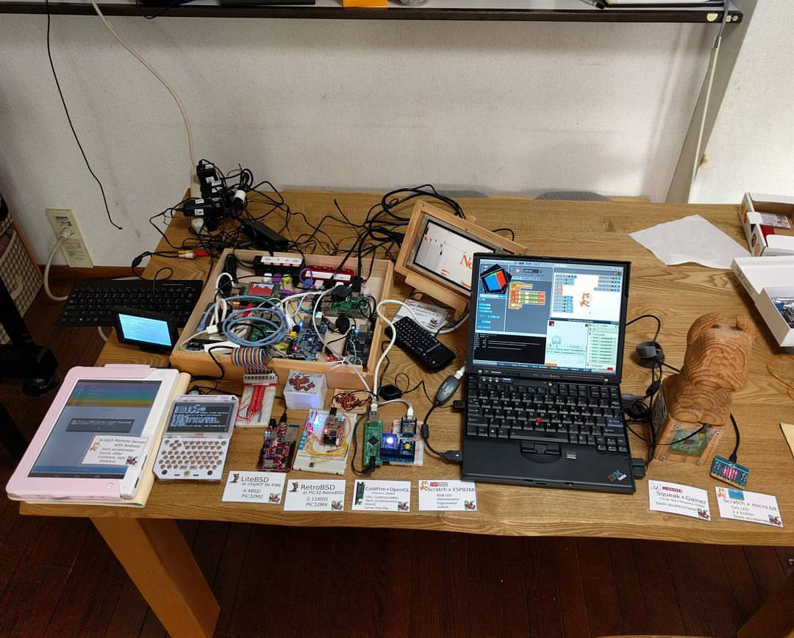
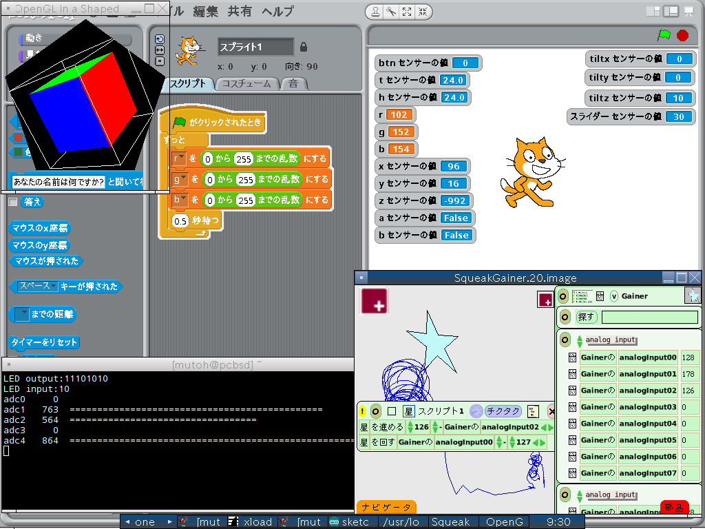
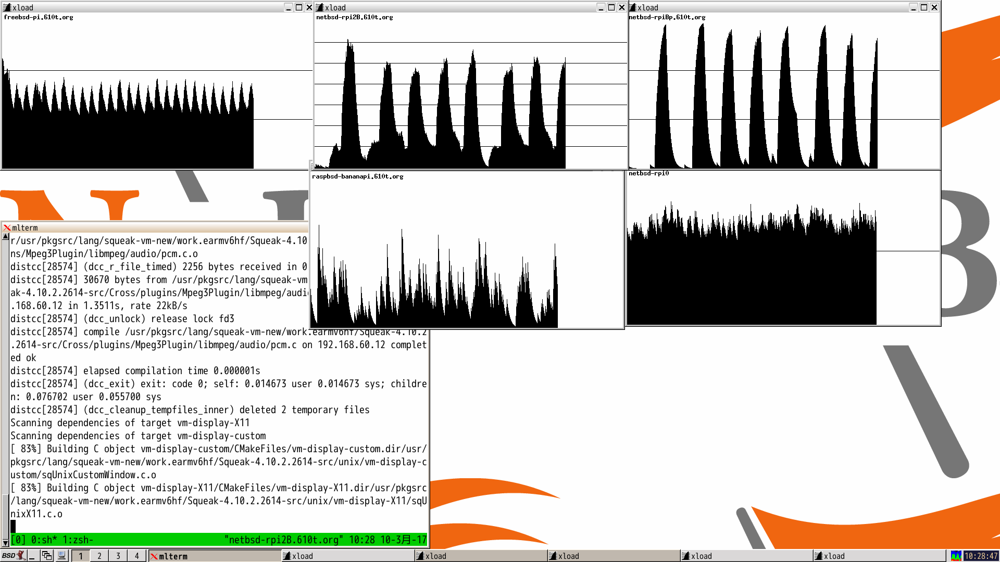
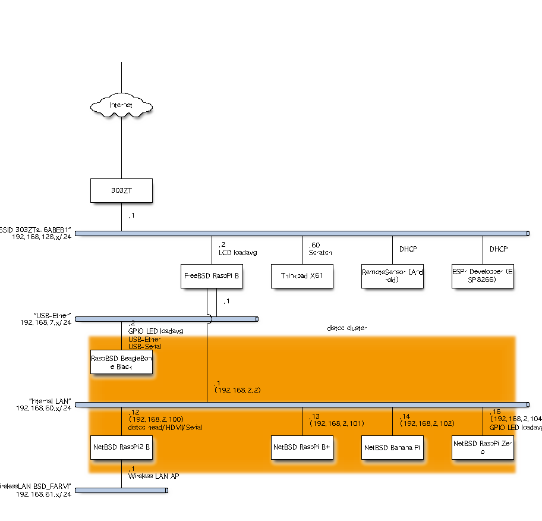

.. K*BUG Booth Guide documentation master file, created by
   sphinx-quickstart on Sat Feb 11 09:29:46 2017.
   You can adapt this file completely to your liking, but it should at least
   contain the root `toctree` directive.

.. header:: Kansai * BSD Users Group Event Guide
.. footer:: https://sacraya.610t.org/kbug/book/booth/KBUGBoothGuide-20th.pdf

.. .. contents:: 目次
..   :depth: 1

関西 *BSDユーザ会ってなあに?
==========================================
関西 *BSDユーザ会は、関西を中心として活動しているBSD(後述)ユーザの集まりです。

Webページは、 http://www.kbug.gr.jp/ です。

.. figure:: images/Kansai.png
   :align: center
   :scale: 70%

   Kansai area (c) OpenStreetMap contributors

BSDってなあに?
---------------------------
BSDはBerkeley Software Distributionの略で、
元々はカリフォルニア大学バークレー校(University of California, Berkeley)で配布されたUNIXシステムの一つのことです。
BSD UNIXは、4.4BSDまでバークレー校で開発された後、FreeBSDやNetBSD, OpenBSD, DragonFly BSDなどに派生し、その後も開発が続いています。

BSDで特筆的なのはそのライセンスで、Copyrightの表示を求める程度の、かなりゆるい条件で再配布ができるようになっています。

.. Policy
.. --------

でもんむし
---------------------------
でもんむしは、K*BUGのマスコットキャラクターです。
むしの頭部分は、K*BUGの「*(アスタリスク)」を表現しています。
Inkscape SVGのソースファイルは、 http://sacraya.610t.org/kbug/logo/ にあります。

.. figure:: images/KBUGseal2.jpg
   :align: center
   :scale: 80%

K*BUGの興味のあること
----------------------
* BSD: FreeBSD (PC-BSD), NetBSD, OpenBSD, DragonlyBSD, (macOS?), (iOS??)...
* arch: i386, amd64, arm (Raspberry Pi), macppc, landisk, zaurus, wzero3, hpcmips, netwalker, ipaq, fonera, vax, …
* kernel hack: kernel module, BLE, serial driver, …
* 新しい技術: DTrace, ZFS, …
* ソフトウエアパッケージ: FreeBSD ports/pkg, pkgsrc/pkg, …
* セキュリティ: pkg audit, maintainance my server, 
* 教育: Scratch, Squeak, …
* プログラミング言語: Prolog, Lisp, awk, Squeak, Scratch, …
* ハードウエア: UPS, HDD, Server, Bluetooth, GPIO, …
* Physical Computing: Gainer (gainerm-lib), Arduino, …
* 電子工作: USB オーディオサーボコントローラー, 雑誌付録基板(arm Gainer, Coldfire, …), …
* その他: OpenCV, ContaoCMS, …
* 木彫: K*BUG看板, デーモン君基板ケース兼トロフィー, …
* **ミーディング後の懇親会(飲み会)**

研究会
--------
約2か月に一度、研究会を行なっています。
研究会のスケジュールは、 http://www.kbug.gr.jp/workshops.html にあります。

以下の二つの会場で研究会が行われることが多いです。

* 株式会社アックス ミーティングルーム (京都): http://www.axe-inc.co.jp/
* グランフロント大阪9F: https://www.grandfront-osaka.jp/

イベント出展
------------------
以下のようなイベントで、イベント出展やセミナーを開催しています。

* オープンソースカンファレンス : http://ospn.jp/
* 関西オープンフォーラム : https://k-of.jp/
* イベント@奈良高専 : http://qml.610t.org/NNCT/event.html

AsiaBSDCon 2017
==========================================
* 公式ページ: https://2017.asiabsdcon.org/
* 2017/3/9(水)-12(日) at 東京理科大学
* Facebook: https://www.facebook.com/events/1718621151740857/
* togetter: https://togetter.com/li/1084357

* RetroBSD GPIO/ADC デモ, LiteBSD GPIO デモ
* ご贈答箱 distcc コンパイルクラスタ
* Scartchと遊ぼう: Android, ESP8266, micro:bit
* Squeak+Gainer
* Coldfire x OpenGL

K*BUG 2017/2/11 研究会
==========================================
* 公式ページ  : http://www.kbug.gr.jp/events/2017-1st.html
* 2017/2/11(土) at 株式会社アックス (京都)
* Facebook : https://www.facebook.com/events/920179428083721/
* togetter : https://togetter.com/li/1078967

.. figure:: images/Booth.png
   :align: center
   :scale: 60%

.. image:: images/RetroBSD.png
.. image:: images/LiteBSD.png
.. image:: images/RaspberryPiZero.png

* RetroBSD: 2.11BSD on MIPS(PIC32MX)。 Pinguino-RetroBSDを使用。
* LiteBSD: 4.4BSDLite on MIPS(PIC32MZ)。 Chipkit WiFireを使用。 シリアルコンソールは、Pocket C.H.I.P。
* NetBSD on Raspberry Pi Zero

Presentations
---------------------------------------
* ExcelでIOzoneのグラフ化
* OSC2015 Kansai@KyotoでのK*BUG : http://qml.610t.org/FreeBSD/OSC2015Kyoto.html
* Raspberry Pi 3 on FreeBSD
* Scratch1.4をBSDで使ってみるために : http://qml.610t.org/FreeBSD/ScratchBSD.html
* iOSで有線LANを使う

Open Source Conference (OSC) 2017 Osaka
=========================================
* 公式ページ : https://www.ospn.jp/osc2017-osaka/
* 2017/1/27(金), 28(土) 大阪産創館
* K*BUG flyer (配布せず) : http://sacraya.610t.org/kbug/flyer/flyer-OSC2017Osaka.pdf
* togetter by JNUG : https://togetter.com/li/1075115
* netbsd-advocacy: "NetBSD machines at Open Source Conference 2017 Osaka" http://mail-index.netbsd.org/netbsd-advocacy/2017/01/28/msg000727.html

JNUG Seminar
-------------
* NetBSD Guide : http://www.soum.co.jp/~jun/OSC2017osaka.pdf
* NetBSD + pkgsrc で PC6001　エミュレータ by @tsutsui : https://speakerdeck.com/tsutsui/osc2017-osaka-pc-6001-emulator-on-netbsd-and-pkgsrc

K*BUG 2016/12/10 meeting
=========================
* 公式ページ  : http://www.kbug.gr.jp/events/18th-plenary.html
* 2016/12/10(土) at 株式会社アックス(京都)

Presentations
---------------------------------------
* Ansible https://www.ansible.com/
* PostgREST https://postgrest.com/
* BHyVeあれこれ : https://people.freebsd.org/~kiri/kbug/bof/2016/No.5/

KOF 2016
=====================
* 公式ページ : https://k-of.jp/2016/
* 2016/11/11(金), 12(土) at ATC (大阪)
* togetter by JNUG : https://togetter.com/li/1047263
* netbsd-advocacy: "NetBSD machines at KANSAI OPEN FORUM 2016" http://mail-index.netbsd.org/netbsd-advocacy/2016/11/16/msg000722.html

BSD BOF
-------------
* NetBSD travel guide : http://www.soum.co.jp/~jun/KOF2016.pdf
* NetBSD/dreamcast IDE HDD接続 ふたたび by @tsutsui  : https://speakerdeck.com/tsutsui/kof2016-netbsd-dreamcast-ide-hdd

K*BUG 2016/10/22 meeting
=========================
* 公式ページ  : http://www.kbug.gr.jp/events/2016-5th.html
* 2016/10/22(土) at グランフロント大阪

Presentations
---------------------------------------
* Smart Connect Managed Server
* How to make XEmacs *-pkg.tar.gz  : https://people.freebsd.org/~kiri/kbug/bof/2016/No.4/
* Bluetooth 4.1 for Raspberry Pi 3
* Broken /var/run by file system trouble 

K*BUG 2016/8/20 meeting
=========================
* 公式ページ  : http://www.kbug.gr.jp/events/2016-4th.html
* 2016/8/20(土) at グランフロント大阪

Presentations
---------------------------------------
* Sphere display: WORLDEYE  http://www.gakkensf.co.jp/worldeye/
* KORG BLE MIDI Keyboard   http://www.korg.com/jp/products/computergear/microkey2_air/
* SSO with OpenID Connect
* https://www.codingame.com/
* UEFI

OSC2016 Kyoto
===============
* 公式ページ : https://www.ospn.jp/osc2016-kyoto/
* 2016/7/29(金), 30(土) at Kyoto Research Park (KRP)
* K*BUG flyer : http://sacraya.610t.org/kbug/flyer/flyer-OSC2016Kyoto.pdf
* Report : http://qml.610t.org/FreeBSD/OSC2016Kyoto.html
* togetter by JNUG : https://togetter.com/li/1005828
* netbsd-advocacy: "NetBSD machines at Open Source Conference 2016 Kyoto" http://mail-index.netbsd.org/netbsd-advocacy/2016/08/01/msg000712.html

.. figure:: images/OSC2016KyotoBooth.png
   :align: center
   :scale: 50%

.. image:: images/OSC2016KyotoPiZero.png
.. image:: images/OSC2016KyotoBox.png
.. image:: images/OSC2016KyotoRetroLiteBSD.png
.. image:: images/OSC2016KyotoGPIO.png
.. image:: images/RogueOne.png
.. image:: images/OSC2016KyotoMeshi.png

.. figure:: images/OSC2016KyotoNetwork.png
   :align: center

* LiteBSD at chipKIT Wi-FIRE 4.4BSD PIC32MZ
* RetroBSD at PIC32-RetroBSD 2.11BSD PIC32MX
* Gift box cluster 2

  * FreeBSD at Raspberry Pi B FreeBSD LCD loadavg via GPIO
  * NetBSD at Banana Pi
  * RaspBSD at BeagleBone Black FreeBSD11 LED loadavg, USB Ether+USB Serial via power port
  * NetBSD at Raspberry Pi 2B LanAP distcc 
  * NetBSD at Raspberry Pi Zero LED loadavg meter via GPIO

JNUG Seminar
-------------
* NetBSD Guide : http://www.soum.co.jp/~jun/OSC2016kyoto.pdf
* PSG sound at NetBSD/luna : https://speakerdeck.com/tsutsui/osc2016-kyoto-psg-tunes-on-netbsd-luna68k
* RetroBSD & LiteBSD by @610t : http://qml.610t.org/FreeBSD/OSC2016Kyoto_JNUG.html

K*BUG 2016/6/18 meeting
=========================
* 公式ページ  : http://www.kbug.gr.jp/events/2016-3rd.html
* 2016/6/18(土) at 株式会社アックス (京都)

Presentations
---------------------------------------
* Upgrade NetBSD with sysupgrade
* Bluetooth LE Mouse on FreeBSD
* Old man porter's rehabilitation  : https://people.freebsd.org/~kiri/kbug/bof/2016/No.3/
* pkgsrc on OS X 10.11

K*BUG 2016/4/23 meeting
=========================
* 公式ページ  : http://www.kbug.gr.jp/events/2016-2nd.html
* 2016/4/23(土) at グランフロント大阪

Presentations
---------------------------------------
* About XIJ (Xorg in Jail)  : https://people.freebsd.org/~kiri/kbug/bof/2016/No.2/

K*BUG 2016/2/20 meeting
=========================
* 公式ページ  : http://www.kbug.gr.jp/events/2016-1st.html
* 2016/2/20(土) at 株式会社アックス (京都)

Presentations
---------------------------------------
* How to maintain many machines.
* Nowadays sh(II) - how to resolve command line options  : https://people.freebsd.org/~kiri/kbug/bof/2016/No.1/
* Home network trouble
* efi
* DNS name resolving error

K*BUG 2016/1/23 meeting
=========================
* 公式ページ  : http://www.kbug.gr.jp/events/17th-plenary.html
* 2016/1/23(土) at グランフロント大阪

Presentations
---------------------------------------
* Trend of ssh log
* FIDO U2F
* About iPad & Apple Configurator
* One older person's monologue  : https://people.freebsd.org/~kiri/kbug/bof/2016/No.0/article.html

K*BUG 2015/10/24 meeting
=========================
* 公式ページ  : http://www.kbug.gr.jp/events/2015-5th.html
* 2015/10/24(土) at 株式会社アックス (京都)

Presentations
---------------------------------------
* Report of Kyoto Brewing Co tasting space  : https://kyotobrewing.com/
* Install FreeBSD at VirtualBox
* Demo of Apple Configurator 2

K*BUG 2015/8/22 meeting
=========================
* 公式ページ  : http://www.kbug.gr.jp/events/2015-4th.html
* 2015/8/22(土) at グランフロント大阪

Presentations
---------------------------------------
* About CIM technology research group
* Can't connect to WiFi, because of assign different IP address
* Replace a university server
* I said "Help me, ENOKI-san"
* Nowadays ZFS (with demo)
* https://letsencrypt.org/

OSC2015 Kansai@Kyoto
=====================
* 公式ページ : https://www.ospn.jp/osc2015-kyoto/
* 2015/8/7(金), 8(土) at Kyoto Research Park (KRP)
* K*BUG flyer : http://sacraya.610t.org/kbug/flyer/flyer-OSC2015Kyoto.pdf
* Report : http://qml.610t.org/FreeBSD/OSC2015Kyoto.html
* togetter by JNUG : https://togetter.com/li/857157
* netbsd-advocacy: "OpenBSD and NetBSD machines at Open Source Conference 2015 Kansai@Kyoto" http://mail-index.netbsd.org/netbsd-advocacy/2015/08/10/msg000691.html

.. figure:: images/OSC2015KyotoBooth.png
   :align: center
   :scale: 70%

.. figure:: images/OSC2015KyotoNetwork.jpg
   :align: center

.. image:: images/MZTX-PI-EXT.jpg
   :scale: 40%
.. image:: images/distcc-rpi-mini.png
   :scale: 50%
.. image:: images/OSC2015KyotoGirl.png
.. image:: images/OSC2015KyotoMeshi.png

* Gift box cluster 1: distcc distributed compile cluster

  * NetBSD Raspberry Pi B+, 2B, Netwalker

* FreeBSD 11 MZTX-PI-EXT LCD via GPIO

JNUG Seminar
-------------
* NetBSD Guide : http://www.soum.co.jp/~jun/OSC2015kyoto.pdf
* Maintainance before 20 years machine at NetBSD : https://speakerdeck.com/tsutsui/osc2015kyoto-netbsd-and-old-machines

K*BUG 2015/6/27 meeting
=========================
* 公式ページ  : http://www.kbug.gr.jp/events/2015-3rd.html
* 2015/6/27(土) at 株式会社アックス (京都)

Presentations
---------------------------------------
* Bluetooth LE
* pkgsrc
* linux Bluetooth LE
* Raidframe and broken disk. Cant boot correctly.
* Gdev: Open source GPGPU Runtime and Driver Software
* Can't use Dell 4K display with FreeBSD

K*BUG 2015/5/16 meeting
=========================
* 公式ページ  : http://www.kbug.gr.jp/events/2015-2nd.html
* 2015/5/16(土) at 株式会社アックス (京都)

Presentations
---------------------------------------
* Nowaday sh

K*BUG 2015/3/7 meeting
=========================
* 公式ページ  : http://www.kbug.gr.jp/events/2015-1st.html
* 2015/3/7(土) at グランフロント大阪

Presentations
---------------------------------------
* blink1
* Raspberry PI GPIO on FreeBSD
* Nowaday HTTP/2
* Light talk about iPad

K*BUG 2015/1/24 meeting
=========================
* 公式ページ  : http://www.kbug.gr.jp/events/16th-plenary.html
* 2015/1/24(土) at 株式会社アックス (京都)

Presentations
---------------------------------------
* BSD-lization at a National College of Technology.
* SmartDoc
* Dake
* ZBSDocs (on SourceForge)
* Backup using dump(8)

KOF 2014
=====================
* 公式ページ : https://k-of.jp/2014/
* 2014/11/7(金), 8(土) at ATC (大阪)
* K*BUG flyer : http://sacraya.610t.org/kbug/flyer/flyer-KOF2014.pdf
* togetter by JNUG : https://togetter.com/li/742243
* netbsd-advocacy: "NetBSD machines at KANSAI OPEN FORUM 2014" https://mail-index.netbsd.org/netbsd-advocacy/2014/11/08/msg000672.html

BSD BOF
-------------
* NetBSD Guide : http://www.soum.co.jp/~jun/KOF2014.pdf
* LUNA at KOF : https://speakerdeck.com/tsutsui/kof-and-luna-at-netbsd-booth

K*BUG 2014/8/23 meeting
=========================
* 公式ページ  : http://www.kbug.gr.jp/events/16th-plenary.html
* 2014/8/23(土) at 株式会社アックス (京都)

Presentations
---------------------------------------
* Upgrade FreeBSD 8.0 with freebsd-update(8) at wide cloud
* Start enjoying with Bluetooth LE
* Introduce tcpcrypt

OSC2014 Kansai@Kyoto
=====================
* 公式ページ : https://www.ospn.jp/osc2014-kyoto/
* 2014/8/1(金), 2(土) at Kyoto Research Park (KRP)
* togetter by JNUG : https://togetter.com/li/700617
* netbsd-advocacy: "NetBSD machines at Open Source Conference 2014 Kyoto" https://mail-index.netbsd.org/netbsd-advocacy/2014/08/09/msg000658.html

.. image:: images/OSC2014KyotoNakamura.png
   :scale: 10%
.. image:: images/OSC2014KyotoMeshi1.png
   :scale: 70%
.. image:: images/OSC2014KyotoMeshi2.png
   :scale: 70%

JNUG Seminar
-------------
* NetBSD Guide : http://www.soum.co.jp/~jun/OSC2014kyoto.pdf
* NetBSD/luna68k event of the past year : https://speakerdeck.com/tsutsui/osc2014-kansai-at-kyoto-netbsd-luna68k-report

OSC2013 Kansai@Kyoto
=====================
* 公式ページ : https://www.ospn.jp/osc2013-kyoto/
* K*BUG flyer : http://sacraya.610t.org/kbug/flyer/flyer-OSC2013Kyoto.pdf
* Booth page : http://qml.610t.org/FreeBSD/OSC2013Kyoto.html
* Report : http://qml.610t.org/FreeBSD/OSC2013KyotoReport.html
* togetter by K*BUG : https://togetter.com/li/506220
* togetter by JNUG : https://togetter.com/li/542885

.. image:: images/OSC2013KyotoAudio.png
.. image:: images/OSC2013KyotoRetroBSD.png
.. image:: images/OSC2013KyotoBoard.png

.. image:: images/OSC2013KyotoMeshi1.png
   :scale: 70%
.. image:: images/OSC2013KyotoMeshi3.png
   :scale: 80%
.. image:: images/OSC2013KyotoMeshi4.png
   :scale: 80%
.. .. image:: images/OSC2013KyotoMeshi2.png

* iCat audio system
* RetroBSD, 2.11BSD on PIC32
* Board, board, board!!

  * Squeak Drive a Car with Gainer compatible board (Design Wave Magazine 2008/05: http://www.cqpub.co.jp/dwm/contents/dwm0126i.htm )
  * OpenGL controller with Coldfire board (Interface 2008/09: http://www.cqpub.co.jp/interface/contents/2008/JA/200809.htm )

JNUG Seminar
-------------
* NetBSD Guide : http://www.soum.co.jp/~jun/OSC2013kyoto.pdf
* all about OMRON LUNA, Do LUNA68K Dream of mltermic Twitter Sheep? : http://www.ceres.dti.ne.jp/tsutsui/osc2013kyoto/NetBSD-luna68k_mlterm-fb_Twitter.html
* Board, board, board!! : http://qml.610t.org/FreeBSD/OSC2013Kyoto610.html

Event @ Nara National College of Technology(NNCT) 13rd
========================================================
* 公式ページ : http://qml.610t.org/NNCT/event13.html
* 2013/4/6(土) at NNCT

* [Hands on] FreeBSD on PC-BSD 9.1
* [Presentation] Let's enjoy BSD with boards : http://qml.610t.org/FreeBSD/furoku2013.html

.. figure:: images/Event@NNCT13-booth.png
   :align: center
   :scale: 20%

.. image:: images/Event@NNCT13-mutoh.png
.. image:: images/Event@NNCT13-board.png
.. image:: images/Event@NNCT13-book.png
.. image:: images/Event@NNCT13-flyer.png
.. image:: images/Event@NNCT13-presen.png
.. image:: images/Event@NNCT13-tonmasa.png

KOF 2012
=====================
* 公式ページ : https://2012.k-of.jp/
* 2012/11/9(金), 10(土) at ATC (大阪)

.. figure:: images/KOF2012Booth.png
   :align: center
   :scale: 40%

.. image:: images/KOF2012Penguin.png
.. image:: images/KOF2012Arduino.png
.. image:: images/KOF2012Zaurus.png
.. image:: images/KOF2012Family.png
.. image:: images/KOF2012POV.png

.. image:: images/KOF2012Meshi1.png
.. image:: images/KOF2012Meshi2.png
.. image:: images/KOF2012Meshi3.png
.. image:: images/KOF2012Meshi4.png

* More Lights!! Spotlight daemon  with OpenBSD/i386 x Gainer
* Squeak+Gainer Drive a Car!!
* Coldfire with 3 axis accelerometer board x OpenBSD/zaurus
* K*BUG POV using Arduino compatible board named Japanino http://otonanokagaku.net/japanino/

BSD BoF
-------------
* NetBSD Guide : http://www.soum.co.jp/~jun/KOF2012.pdf
* Recent BSD I/O : http://qml.610t.org/FreeBSD/BSD_IO_2012_presen.html
* (What is K*BUG? : http://qml.610t.org/FreeBSD/KBUG_KOF2012_presen.html )

OSC2012 Kansai@Kyoto
=====================
* 公式ページ : https://www.ospn.jp/osc2012-kyoto/
* 2012/8/3(金), 4(土) at KRP
* togetter by JNUG : https://togetter.com/li/350035

.. figure:: images/OSC2012KyotoBooth.png
   :align: center
   :scale: 80%

.. image:: images/OSC2012KyotoBoothView.png
.. image:: images/OSC2012KyotoZaurus.png
.. image:: images/OSC2012KyotoMyRoom.png

.. image:: images/OSC2012KyotoKBUG.jpg
.. image:: images/OSC2012KyotoRetroBSD.jpg
.. image:: images/OSC2012KyotoBoothBack.png

.. image:: images/OSC2012KyotoMeshi1-1.png
.. image:: images/OSC2012KyotoMeshi3.png

* RetroBSD, 2.11BSD on PIC32
* USL-5P
* High density zaurus rack.
* More Lights!! Spotlight daemon  with NetBSD/hpcmips (WS007SH) x Gainer

JNUG Seminar
-------------
* NetBSD Guide : http://www.soum.co.jp/~jun/OSC2012kyoto.pdf
* Recent NetBSD/luna68k : http://www.ceres.dti.ne.jp/tsutsui/osc2012kyoto/NetBSD-luna68k-updates.html
* Repair power unit of OMRON Luna-II : https://togetter.com/li/354562

Event @ NNCT 12nd
=================================================
* 公式ページ : http://qml.610t.org/NNCT/event12.html
* 2012/7/29(Sun) at NNCT

* [Hands on] Install PC-BSD  http://qml.610t.org/FreeBSD/PCBSD.html
* [Booth] Install BSD at various system
* [Presentation] Use BSD at work by BSD-BA : http://www.bsd-ba.org/

.. image:: images/Event@NNCT-all.png
.. image:: images/Event@NNCT-dreamcast.png
.. image:: images/Event@NNCT-sharp.png
.. image:: images/Event@NNCT-MobileGear.png
.. image:: images/Event@NNCT-PenCentra.png
.. image:: images/Event@NNCT-Fonera.png
.. .. image:: images/Event@NNCT-Meshi.png

KOF 2011
=====================
* 公式ページ : https://k-of.jp/2011/
* 2011/11/11(金), 12(土) at ATC
* togetter by JNUG : https://togetter.com/li/213724

.. image:: images/KOF2011USL-5P.JPG
   :scale: 10%
.. image:: images/KOF2011Network.png
   :scale: 22%
.. image:: images/KOF2011Booth.JPG
   :scale: 15%

* Active/Standby Firewall with 2 OpenBSD/landisk at USL-5P : http://www.rururu.org/fswiki/wiki.cgi?page=OpenBSD%2Flandisk%A4%C7Active%2DStandby+Firewall
* {Net, Free, Open DragonFly}BSD at NetBSD/xen 

BSD BoF
-------------
* NetBSD Guide : http://www.soum.co.jp/~jun/KOF2011.pdf
* Why enigmatic machines? by @tsutsuii : http://www.ceres.dti.ne.jp/tsutsui/kof2011/Why-enigmatic-machines.html
* pkgsrc

OSC2011 Kansai@Kyoto
=====================
* 公式ページ : https://www.ospn.jp/osc2011-kyoto/
* 2011/7/15(金), 16(土) at KRP
* K*BUG flyer : http://sacraya.610t.org/kbug/flyer/flyer-OSC2011Kyoto.pdf

.. figure:: images/OSC2011KyotoBooth.png
   :align: center
   :scale: 50%

.. image:: images/OSC2011KyotoBuild.png
   :scale: 75%
.. image:: images/OSC2011KyotoVM.png
.. image:: images/OSC2011KyotoOpenBSD.png
.. image:: images/OSC2011KyotoJoyStick.png
.. image:: images/OSC2011KyotoDesktop.png
.. image:: images/OSC2011KyotoGion1.png

* OpenBSD/landisk USL-5P
* {Net, Free, Open, DragonFly}BSD at NetBSD/xen 
* Visualization NetBSD and FreeBSD build process.
* Squeak+Gainer Drive a Car!! with FreeBSD.
* More Light!! swing daemon based on Arduino.

JNUG Seminar
-------------
* NetBSD Guide : http://www.soum.co.jp/~jun/OSC2011kyoto.pdf
* "NetBSD/m68k will never die!" :  http://www.ceres.dti.ne.jp/tsutsui/osc2011kyoto/NetBSD-m68k-will-never-die.html

OSC2010 Kansai@Kyoto
=====================
* 公式ページ : https://www.ospn.jp/osc2010-kyoto/
* 2010/7/9(金), 10(土) at kcg.edu: http://www.kcg.ac.jp/
* K*BUG flyer : http://sacraya.610t.org/kbug/flyer/flyer-OSC2010Kyoto.pdf

Booth
------
* Fastest script for installing FreeBSD.
* Try installation NetBSD/bebox, but fail...

OSC2010 Kansai@Kobe
=====================
* 公式ページ : https://www.ospn.jp/osc2010-kobe/
* 2010/3/13(土) at Kobe Industrial Promotion Center
* K*BUG flyer : http://sacraya.610t.org/kbug/flyer/flyer-OSC2010Kobe.pdf

JNUG Seminar
-------------
* "making of SMC_TT - VME Ethernet using ISA NIC for ATARI TT030" by @tsutsuii : http://www.ceres.dti.ne.jp/tsutsui/osc2010kobe/SMC_TT-OSC2010Kobe.html
* Ethernet card SMC_TT for ATARI TT030 :https://togetter.com/li/76769

KOF 2009
=====================
* 公式ページ : https://k-of.jp/2009/

* 2009/11/6(金), 7(土) at ATC
* K*BUG flyer : http://sacraya.610t.org/kbug/flyer/flyer-KOF2009.pdf

.. figure:: images/KOF2009Booth.png
   :align: center
   :scale: 60%

* NetBSD/mac68k on LC475Upgrade

OSC2009 Kansai@Kyoto
=====================
* 公式ページ : https://www.ospn.jp/osc2009-kansai/
* 2009/7/10(金), 11(土) at kcg.edu: http://www.kcg.ac.jp/

Booth
------
* LED CPU meter
* BSD daemon statue gadgets
* USL-5P+USB LCD(landisk)

Nico-Tech: Kyoto Meeting (NK:M)
================================
* 公式ページ : http://wiki.nicotech.jp/nico_tech/index.php?NTM2%2F%E9%96%A2%E8%A5%BF
* 2009/3/21(土) at Saiin-Kasuga shrine (京都) http://www.kasuga.or.jp/
* Report : http://qml.610t.org/squeak/mutoh_20090321.html
* Presentation : http://www.nicovideo.jp/watch/sm6562064 (7:00-9:40)

.. image:: images/NKM2009Booth.png
   :scale: 60%
.. image:: images/NKM2009Scratch.png
   :scale: 30%
.. image:: images/NKM2009Make.png
   :scale: 30%

* Squeak-ja meets K*BUG
* On FreeBSD

  * Squeak+Gainer Drive a Car!!
  * Scartch + PicoBoard
  * Servo motor daemon's tail  drive by USB audio device

* WorldStethoscope : http://swikis.ddo.jp/WorldStethoscope/6
* Squeak on Pocket Post Pet (Windows CE)

KOF 2008
=====================
* 公式ページ : https://k-of.jp/2008/
* 2008/11/7(金), 8(土) at ATC (大阪)
* K*BUG flyer : http://sacraya.610t.org/kbug/flyer/flyer-KOF2008.pdf

.. figure:: images/KOF2008Booth.png
   :align: center
   :scale: 70%

.. image:: images/KOF2008daemon.png
.. image:: images/KOF2008USL-5P.png
.. image:: images/KOF2008Backyard.png
   :scale: 30%
.. image:: images/KOF2008Ishihara.png
   :scale: 30%
.. image:: images/KOF2008Meshi1.png
.. image:: images/KOF2008Meshi2.png

* OpenBSD/landisk at USL-5P
* Devices: Servo motor deive deamon's tails using USB audio, Squeak+Gainer http://www.yengawa.com/squeak_gainer

OSC2008 Kansai@Kyoto
=====================
* 公式ページ : https://www.ospn.jp/osc2008-kansai/
* 2008/7/18(金), 19(土) at kcg.edu: http://www.kcg.ac.jp/

.. figure:: images/OSC2008KyotoBooth.png
   :scale: 70%
   :align: center

.. image:: images/OSC2008KyotoIshihara.png
.. image:: images/OSC2008KyotoBag.png
.. image:: images/OSC2008KyotoAlpha.png
.. image:: images/OSC2008KyotoMiku.png
.. image:: images/OSC2008KyotoMutoh.png
.. image:: images/OSC2008KyotoMen.png
.. image:: images/OSC2008KyotoFlyer.png

.. image:: images/OSC2008KyotoKonomi.png
.. image:: images/OSC2008KyotoYakiRamen.png
.. image:: images/OSC2008KyotoCheese.png
.. .. image:: images/OSC2008KyotoMeshi1.png

* BSD for various machines: sgi O2, BeBox(not work), Zaurus, ML115, Fonera, NetBSD/hpcmips, hpcsh, evbmips, alpha (digital Alpha Multia)
* Miku Hatsune paper doll with Six servo moters controlled by USB audio
* Devices: USB one-seg tuner, UHID based themal sensor USB-RH https://strawberry-linux.com/catalog/items?code=52002

KOF 2007
===========
* 公式ページ : https://k-of.jp/2007/
* 2007/11/9(金), 10(土) at ATC

.. image:: images/KOF2007Booth.png
   :scale: 9%
.. image:: images/KOF2007Board.png
   :scale: 9%
.. image:: images/KOF2007Wasabi.png
   :scale: 9%

Event @ NNCT 11st
=================================================
* 公式ページ : http://qml.610t.org/NNCT/event13.html
* 2007/3/31(土) at NNCT
* Report : http://qml.610t.org/NNCT/report_event_11th.html

.. image:: images/Event@NNCT11-OLPC.png
.. image:: images/Event@NNCT11-GRUB.png
.. .. image:: images/Event@NNCT11-WiFi.png
.. image:: images/Event@NNCT11-RoboCup.png
.. image:: images/Event@NNCT11-cherry.png
.. image:: images/Event@NNCT11-meshi1.png
.. image:: images/Event@NNCT11-meshi2.png

* Introduction NNCT Information Engineering Computer Room.
* FreeBSD ports: RoboCup 2D simulator
* Create Squeak Dual Boot CDROM : http://qml.610t.org/squeak/squeak_cdrom.html

KOF 2006
===========
* 公式ページ : https://k-of.jp/2006/
* 2006/11/17(金), 18(土) at ATC

.. image:: images/KOF2006Booth.png
   :scale: 20%
.. image:: images/KOF2006Book.png
   :scale: 20%
.. image:: images/KOF2006Presen.png
   :scale: 20%

* On FreeBSD

  * Croquet: https://en.wikipedia.org/wiki/Croquet_Project
  * Squeak + WorldStethoscope
  * Moeru Squeak ( http://moesuku.ofg.jp/ ) on ONScripter ( https://onscripter.osdn.jp/onscripter.html ) 

Event @ NNCT 3rd
=================================================
* 2002/7/20(土) at NNCT
* Report  published at FreeBSD Press No12: http://sacraya.610t.org/Press/No12/nnct-event/

Presentations
---------------------------------------
* Report: xcast6 online meeting
* Postfix
* One chip microcomputer AVR
* Recovery 48 computers using PXEBOOT in 30 minutes
* Document using SmartDoc
* About DocBook/SGML

Event @ NNCT 1st
=================================================
* 2001/8/4(土) at NNCT
* Report published at FreeBSD Press No7: http://sacraya.610t.org/Press/No7/bugs/

.. image:: images/Event@NNCT1-media.png
.. image:: images/Event@NNCT1-working.png
.. image:: images/Event@NNCT1-poster.png
.. image:: images/Event@NNCT1-machines.jpg

* BSD for various machines.

  * NetBSD/hpcmips: NEC MobileGearII 330R, Fujitsu PenCentura130, PocketPostpet 
  * NetBSD/sun3: Sun 3/60
  * NetBSD/sun3x: Sun 3/80
  * NetBSD/mac68k: Macintosh IIcx
  * NetBSD/news68k: Sony NEWS NWS-831,PWS-1550,NWS-1720

* Install hands on
* BSD media in Japan

* Print version PDF is at http://sacraya.610t.org/kbug/book/booth/KBUGBoothGuide-print.pdf
* Valid link PDF is at http://sacraya.610t.org/kbug/book/booth/KBUGBoothGuide.pdf
* HTML version is at http://sacraya.610t.org/kbug/book/booth/singlehtml/
* Source is at https://github.com/610t/kbug/tree/master/book/booth/

.. image:: images/QRcodePDF.png
   :scale: 80%
.. image:: images/QRcodePDF-print.png
   :scale: 80%
.. image:: images/QRcodeWWW.png
   :scale: 80%
.. image:: images/QRcodeGithub.png
   :scale: 60%

.. csv-table::
   :align: center

   2018/6/,	AsiaBSDCon 2017 edition

