.. K*BUG Booth Guide documentation master file, created by
   sphinx-quickstart on Sat Feb 11 09:29:46 2017.
   You can adapt this file completely to your liking, but it should at least
   contain the root `toctree` directive.

.. header:: 関西 *BSDユーザ会20周年記念誌
.. footer:: https://sacraya.610t.org/kbug/book/20th/KBUGBoothGuide-20th.pdf

.. contents:: 目次
   :depth: 3

関西 *BSDユーザ会20周年記念誌
##############################

関西 *BSDユーザ会ってなあに?
==========================================
関西 *BSDユーザ会(Kansai *BSD Users Group; K*BUG) は、関西を中心として活動しているBSD(後述)ユーザの集まりです。

Webページは、 http://www.kbug.gr.jp/ です。

.. figure:: images/Kansai.png
   :align: center
   :scale: 70%

   関西地方 (c) OpenStreetMap contributors

BSDってなあに?
---------------------------
BSDはBerkeley Software Distributionの略で、
元々はカリフォルニア大学バークレー校(University of California, Berkeley)で配布されたUNIXシステムの一つのことです。
BSD UNIXは、4.4BSDまでバークレー校で開発された後、FreeBSDやNetBSD, OpenBSD, DragonFly BSDなどに派生し、その後も開発が続いています。

BSDで特筆的なのはそのライセンスで、Copyrightの表示を求める程度の、かなりゆるい条件で再配布ができるようになっています。

.. Policy
.. --------

でもんむし
---------------------------
でもんむしは、K*BUGのマスコットキャラクターです。
むしの頭部分は、K*BUGの「*(アスタリスク)」を表現しています。
Inkscape SVGのソースファイルは、 http://sacraya.610t.org/kbug/logo/ にあります。

.. figure:: images/KBUGseal2.jpg
   :align: center
   :scale: 80%

K*BUGメンバーの興味のあること
----------------------
* BSD: FreeBSD (PC-BSD), NetBSD, OpenBSD, DragonlyBSD, (macOS?), (iOS??)...
* arch: i386, amd64, arm (Raspberry Pi), macppc, landisk, zaurus, wzero3, hpcmips, netwalker, ipaq, fonera, vax, …
* kernel hack: kernel module, BLE, serial driver, …
* 新しい技術: DTrace, ZFS, …
* ソフトウエアパッケージ: FreeBSD ports/pkg, pkgsrc/pkg, …
* セキュリティ: pkg audit, maintainance my server, 
* 教育: Scratch, Squeak, …
* プログラミング言語: Prolog, Lisp, awk, Squeak, Scratch, …
* ハードウエア: UPS, HDD, Server, Bluetooth, GPIO, …
* Physical Computing: Gainer (gainerm-lib), Arduino, …
* 電子工作: USB オーディオサーボコントローラー, 雑誌付録基板(arm Gainer, Coldfire, …), …
* その他: OpenCV, ContaoCMS, …
* 木彫: K*BUG看板, デーモン君基板ケース兼トロフィー, …
* **ミーディング後の懇親会(飲み会)**

研究会
--------
約2か月に一度、研究会を行なっています。
研究会のスケジュールは、 http://www.kbug.gr.jp/workshops.html にあります。

以下の二つの会場で研究会が行われることが多いです。

* 株式会社アックス ミーティングルーム (京都): http://www.axe-inc.co.jp/
* グランフロント大阪9F: https://www.grandfront-osaka.jp/

イベント出展
------------------
以下のようなイベントで、イベント出展やセミナーを開催しています。

* オープンソースカンファレンス : http://ospn.jp/
* 関西オープンフォーラム : https://k-of.jp/
* イベント@奈良高専 : http://qml.610t.org/NNCT/event.html

これまでのイベント情報
==========================================

K*BUG 2019// 研究会
----------------------------------------
* 公式ページ  : http://www.kbug.gr.jp/events/2019-.html
* 2019//(土) at 株式会社アックス (京都) グランフロント大阪

発表
^^^^^^^^^^^^^^^^^^^^^^^^^^^^^^^

K*BUG 2018/12/8 第20回定期総会 + 併設研究会
----------------------------------------
* 公式ページ  : http://www.kbug.gr.jp/events/20th-plenary.html
* 2018//(土) at 株式会社アックス (京都)

発表
^^^^^^^^^^^^^^^^^^^^^^^^^^^^^^^

K*BUG 2018/10/13 研究会
----------------------------------------
* 公式ページ  : http://www.kbug.gr.jp/events/2018-5th.html
* 2018/10/13(土) at グランフロント大阪

発表
^^^^^^^^^^^^^^^^^^^^^^^^^^^^^^^

K*BUG 2018/8/4 研究会
----------------------------------------
* 公式ページ  : http://www.kbug.gr.jp/events/2018-4th.html
* 2018/8/4(土) at 株式会社アックス (京都)

発表
^^^^^^^^^^^^^^^^^^^^^^^^^^^^^^^
* NetBSD pkgin
* ZFS突然死は必然死だったの巻 http://ds.truefc.org/~kiri/kbug/bof/2018/No.4/
* 新ノートを買った
* macOSでpkgsrc
* OSC 2018 Kyotoのご報告 https://scrapbox.io/BSD/OSC_2018_Kyotoのご報告(公開版)

OSC2018 Kyoto
-----------------------
* 公式ページ : https://www.ospn.jp/osc2018-kyoto/
* 2016/7/29(金), 30(土) at 京都リサーチパーク
* K*BUGチラシ: http://sacraya.610t.org/kbug/flyer/flyer-OSC2018Kyoto.pdf
* 報告 : https://scrapbox.io/BSD/OSC_2018_Kyotoのご報告(公開版)
* togetter by JNUG : https://togetter.com/li/1252935
* netbsd-advocacy: "NetBSD machines at Open Source Conference 2018 Kyoto" http://mail-index.netbsd.org/netbsd-advocacy/2018/08/06/msg000780.html

K*BUG展示
^^^^^^^^^^^^^^^^^^^^^^^^^^^^^^^
* ご贈答箱クラスタ (evbarm&aarch64)
  * FreeBSD at Raspberry Pi B FreeBSD LCD loadavg via GPIO
  * NetBSD at Banana Pi
  * RaspBSD at BeagleBone Black FreeBSD11 LED loadavg, USB Ether+USB Serial via power port
  * NetBSD at Raspberry Pi 2B LanAP distcc 
  * NetBSD at Raspberry Pi Zero LED loadavg meter via GPIO
* LiteBSD at chipKIT Wi-FIRE 4.4BSD PIC32MZ
* RetroBSD at PIC32-RetroBSD 2.11BSD PIC32MX
* CUDA at NVIDIA Tegra TK1
* INDI & ASCOM

K*BUGセミナー: 関西*BSDユーザ会研究会番外編
^^^^^^^^^^^^^^^^^^^^^^^^^^^^^^^
* 関西*BSDユーザ会(K*BUG)のご紹介 https://scrapbox.io/BSD/%E9%96%A2%E8%A5%BF*BSD%E3%83%A6%E3%83%BC%E3%82%B6%E4%BC%9A(K*BUG)%E3%81%AE%E3%81%94%E7%B4%B9%E4%BB%8B
* macOSでpkgsrc
* NetBSD de Blinkt https://scrapbox.io/BSD/NetBSD_de_Blinkt

JNUGセミナー: NetBSDのご紹介
^^^^^^^^^^^^^^^^^^^^^^^^^^^^^^^
* NetBSD Guide : http://www.re.soum.co.jp/~jun/OSC2018kyoto.pdf
* こんにちはワークステーション LUNA対応版 https://github.com/moveccr/luna-audio/blob/master/docs/osc18kyoto.pdf

K*BUG 2018/6/9 研究会
----------------------------------------
.. * 公式ページ  : http://www.kbug.gr.jp/events/2018-3rd.html
* 2018/6/9(土) at グランフロント大阪

発表
^^^^^^^^^^^^^^^^^^^^^^^^^^^^^^^
* ZFS突然死の原因はやはりZFSのバグだった? http://ds.truefc.org/~kiri/kbug/bof/2018/No.3/
* NVIDIA Jetson TX1のご紹介 https://scrapbox.io/BSD/NVIDIA_Jetson_TX1%E3%81%AE%E3%81%94%E7%B4%B9%E4%BB%8B

K*BUG 2018/4/14 研究会
----------------------------------------
* 公式ページ  : http://www.kbug.gr.jp/events/2018-2nd.html
* 2018/4/14(土) at 株式会社アックス (京都)

発表
^^^^^^^^^^^^^^^^^^^^^^^^^^^^^^^
* macOSの小ネタ
* Dovecotのmmapのエラー
* Bluetooth心拍計
* Google Home Mini

K*BUG 2018/2/10 研究会
----------------------------------------
.. * 公式ページ  : http://www.kbug.gr.jp/events/2018-1st.html
* 2018/2/10(土) at グランフロント大阪

発表
^^^^^^^^^^^^^^^^^^^^^^^^^^^^^^^
* SG116jに12.0を入れてみた http://ds.truefc.org/~kiri/kbug/bof/2018/No.1/
* Webカメラが動かない
* NetBSD on C.H.I.P. http://qml.610t.org/FreeBSD/KBUG_CHIP.html

K*BUG 2017/12/9 第19回定期総会 + 併設研究会
---------------------------------------------------
* 公式ページ  : http://www.kbug.gr.jp/events/19th-plenary.html
* 2017/12/9(土) at グランフロント大阪

発表
^^^^^^^^^^^^^^^^^^^^^^^^^^^^^^^
* NanoPi Neo2でNetBSDを動かしたいと思ってたら動いたの http://qml.610t.org/FreeBSD/KBUG_NanoPiNeo2.html

K*BUG 2017/10/14 研究会
----------------------------------------
* 公式ページ  : http://www.kbug.gr.jp/events/2017-5th.html
* 2017/10/14(土) at 株式会社アックス (京都)

発表
^^^^^^^^^^^^^^^^^^^^^^^^^^^^^^^
* "Hobbes' Internet Timeline"の日本語訳 https://people.freebsd.org/~kiri/kbug/bof/2017/No.3/
* macOS High Sierra雑話
* daemon(8)話
* マイコンBSDよもやま

K*BUG 2017/8/19 研究会
----------------------------------------
* 公式ページ  : http://www.kbug.gr.jp/events/2017-4th.html
* 2017/8/19(土) at グランフロント大阪

K*BUG 2017/6/17 研究会
----------------------------------------
* 公式ページ  : http://www.kbug.gr.jp/events/2017-3rd.html
* 2017/6/17(土) at 株式会社アックス (京都)

K*BUG 2017/4/15 研究会
----------------------------------------
* 公式ページ  : http://www.kbug.gr.jp/events/2017-2nd.html
* 2017/4/15(土) at グランフロント大阪

発表
^^^^^^^^^^^^^^^^^^^^^^^^^^^^^^^
* RaSCSIの紹介など
* sbackup -A Simple Backup script- https://people.freebsd.org/~kiri/kbug/bof/2017/No.2/
* Rasperry PI3 FreeBSD
* pkgsrc-2017Q1雑談

AsiaBSDCon 2017
----------------------------------------
* 公式ページ: https://2017.asiabsdcon.org/
* 2017/3/9(水)-12(日) at 東京理科大学
* Facebook: https://www.facebook.com/events/1718621151740857/
* togetter: https://togetter.com/li/1084357

* RetroBSD GPIO/ADC デモ, LiteBSD GPIO デモ
* ご贈答箱 distcc コンパイルクラスタ
* Scartchと遊ぼう: Android, ESP8266, micro:bit
* Squeak+Gainer
* Coldfire x OpenGL

K*BUG 2017/2/11 研究会
----------------------------------------
* 公式ページ  : http://www.kbug.gr.jp/events/2017-1st.html
* 2017/2/11(土) at 株式会社アックス (京都)
* Facebook : https://www.facebook.com/events/920179428083721/
* togetter : https://togetter.com/li/1078967

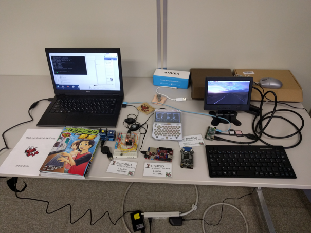

.. image:: images/RetroBSD.png
.. image:: images/LiteBSD.png
.. image:: images/RaspberryPiZero.png

* RetroBSD: 2.11BSD on MIPS(PIC32MX)。 Pinguino-RetroBSDを使用。
* LiteBSD: 4.4BSDLite on MIPS(PIC32MZ)。 Chipkit WiFireを使用。 シリアルコンソールは、Pocket C.H.I.P。
* NetBSD on Raspberry Pi Zero

発表
^^^^^^^^^^^^^^^^^^^^^^^^^^^^^^^
* ExcelでIOzoneのグラフ化
* OSC2015 Kansai@KyotoでのK*BUG : http://qml.610t.org/FreeBSD/OSC2015Kyoto.html
* Raspberry Pi 3 on FreeBSD
* Scratch1.4をBSDで使ってみるために : http://qml.610t.org/FreeBSD/ScratchBSD.html
* iOSで有線LANを使う

Open Source Conference (OSC) 2017 Osaka
---------------------------------------
* 公式ページ : https://www.ospn.jp/osc2017-osaka/
* 2017/1/27(金), 28(土) 大阪産創館
* K*BUGチラシ(配布せず) : http://sacraya.610t.org/kbug/flyer/flyer-OSC2017Osaka.pdf
* togetter by JNUG : https://togetter.com/li/1075115
* netbsd-advocacy: "NetBSD machines at Open Source Conference 2017 Osaka" http://mail-index.netbsd.org/netbsd-advocacy/2017/01/28/msg000727.html

JNUG Seminar
^^^^^^^^^^^^^^^^^^^^^^^^^^^^^^^
* NetBSD Guide : http://www.soum.co.jp/~jun/OSC2017osaka.pdf
* NetBSD + pkgsrc で PC6001　エミュレータ by @tsutsui : https://speakerdeck.com/tsutsui/osc2017-osaka-pc-6001-emulator-on-netbsd-and-pkgsrc

K*BUG 2016/12/10  第18回定期総会 + 併設研究会
--------------------------------
* 公式ページ  : http://www.kbug.gr.jp/events/18th-plenary.html
* 2016/12/10(土) at 株式会社アックス(京都)

発表
^^^^^^^^^^^^^^^^^^^^^^^^^^^^^^^
* Ansibleのお話 https://www.ansible.com/
* PostgRESTのお話 https://postgrest.com/
* BHyVeあれこれ : https://people.freebsd.org/~kiri/kbug/bof/2016/No.5/

KOF 2016
----------------------------
* 公式ページ : https://k-of.jp/2016/
* 2016/11/11(金), 12(土) at ATC (大阪)
* togetter by JNUG : https://togetter.com/li/1047263
* netbsd-advocacy: "NetBSD machines at KANSAI OPEN FORUM 2016" http://mail-index.netbsd.org/netbsd-advocacy/2016/11/16/msg000722.html

BSD BOF
^^^^^^^^^^^^^^^^^^^^^^^^^^^^^^^
* NetBSD travel guide : http://www.soum.co.jp/~jun/KOF2016.pdf
* NetBSD/dreamcast IDE HDD接続 ふたたび by @tsutsui  : https://speakerdeck.com/tsutsui/kof2016-netbsd-dreamcast-ide-hdd

K*BUG 2016/10/22 研究会
--------------------------------
* 公式ページ  : http://www.kbug.gr.jp/events/2016-5th.html
* 2016/10/22(土) at グランフロント大阪

発表
^^^^^^^^^^^^^^^^^^^^^^^^^^^^^^^
* スマートコネクトマネージドサーバについて
* XEmacsの*-pkg.tar.gz の作り方 https://people.freebsd.org/~kiri/kbug/bof/2016/No.4/
* RPI3 買ったので bluetooth 4.1 周り整備する話
* ファイルシステム障害で/var/run が壊れた話

K*BUG 2016/8/20 研究会
--------------------------------
* 公式ページ  : http://www.kbug.gr.jp/events/2016-4th.html
* 2016/8/20(土) at グランフロント大阪

発表
^^^^^^^^^^^^^^^^^^^^^^^^^^^^^^^
* 球面ディスプレイ: WORLDEYE http://www.gakkensf.co.jp/worldeye/
* KORGの BLE MIDI キーボード  http://www.korg.com/jp/products/computergear/microkey2_air/
* OpenID Connect で簡単に SSO
* https://www.codingame.com/
* UEFI

OSC2016 Kyoto
-----------------------
* 公式ページ : https://www.ospn.jp/osc2016-kyoto/
* 2016/7/29(金), 30(土) at Kyoto Research Park (KRP)
* K*BUGチラシ: http://sacraya.610t.org/kbug/flyer/flyer-OSC2016Kyoto.pdf
* Report : http://qml.610t.org/FreeBSD/OSC2016Kyoto.html
* togetter by JNUG : https://togetter.com/li/1005828
* netbsd-advocacy: "NetBSD machines at Open Source Conference 2016 Kyoto" http://mail-index.netbsd.org/netbsd-advocacy/2016/08/01/msg000712.html

.. figure:: images/OSC2016KyotoBooth.png
   :align: center
   :scale: 50%

.. image:: images/OSC2016KyotoPiZero.png
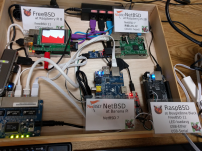
.. image:: images/OSC2016KyotoRetroLiteBSD.png
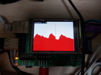
.. image:: images/RogueOne.png
.. image:: images/OSC2016KyotoMeshi.png

.. figure:: images/OSC2016KyotoNetwork.png
   :align: center

* LiteBSD at chipKIT Wi-FIRE 4.4BSD PIC32MZ
* RetroBSD at PIC32-RetroBSD 2.11BSD PIC32MX
* Gift box cluster 2

  * FreeBSD at Raspberry Pi B FreeBSD LCD loadavg via GPIO
  * NetBSD at Banana Pi
  * RaspBSD at BeagleBone Black FreeBSD11 LED loadavg, USB Ether+USB Serial via power port
  * NetBSD at Raspberry Pi 2B LanAP distcc 
  * NetBSD at Raspberry Pi Zero LED loadavg meter via GPIO

JNUG Seminar
^^^^^^^^^^^^^^^^^^^^^^^^^^^^^^^
* NetBSD Guide : http://www.soum.co.jp/~jun/OSC2016kyoto.pdf
* PSG sound at NetBSD/luna : https://speakerdeck.com/tsutsui/osc2016-kyoto-psg-tunes-on-netbsd-luna68k
* RetroBSD & LiteBSD by @610t : http://qml.610t.org/FreeBSD/OSC2016Kyoto_JNUG.html

K*BUG 2016/6/18 研究会
--------------------------------
* 公式ページ  : http://www.kbug.gr.jp/events/2016-3rd.html
* 2016/6/18(土) at 株式会社アックス (京都)

発表
^^^^^^^^^^^^^^^^^^^^^^^^^^^^^^^
* NetBSDをsysupgradeで更新
* Bluetooth LE Mouse on FreeBSD
* おっさん porter のリハビリ https://people.freebsd.org/~kiri/kbug/bof/2016/No.3/
* pkgsrc on OS X 10.11

K*BUG 2016/4/23 研究会
--------------------------------
* 公式ページ  : http://www.kbug.gr.jp/events/2016-2nd.html
* 2016/4/23(土) at グランフロント大阪

発表
^^^^^^^^^^^^^^^^^^^^^^^^^^^^^^^
* XIJ(Xorg in Jail)な話  : https://people.freebsd.org/~kiri/kbug/bof/2016/No.2/

K*BUG 2016/2/20 研究会
--------------------------------
* 公式ページ  : http://www.kbug.gr.jp/events/2016-1st.html
* 2016/2/20(土) at 株式会社アックス (京都)

発表
^^^^^^^^^^^^^^^^^^^^^^^^^^^^^^^
* マシンが増えた場合の管理方法について
* 今さら sh(1) で作ってみた
* 宅内ネットワークトラブル
* efi の話
* DNS の名前怪傑エラー (現在進行中)

K*BUG 2016/1/23 第17回定期総会 + 併設研究会
--------------------------------
* 公式ページ  : http://www.kbug.gr.jp/events/17th-plenary.html
* 2016/1/23(土) at グランフロント大阪

発表
^^^^^^^^^^^^^^^^^^^^^^^^^^^^^^^
* sshd のログの傾向
* こんなん買いました: FIOD U2F
* iPad & Apple Configurator よもやま話
* 2015 年版 AAJ

K*BUG 2015/10/24 研究会
--------------------------------
* 公式ページ  : http://www.kbug.gr.jp/events/2015-5th.html
* 2015/10/24(土) at 株式会社アックス (京都)

発表
^^^^^^^^^^^^^^^^^^^^^^^^^^^^^^^
* 京都醸造所試飲スペースの報告 https://kyotobrewing.com/
* FreeBSD を VirtualBox にインストールしてみた
* Apple Configurator 2 についての軽いデモなど

K*BUG 2015/8/22 研究会
--------------------------------
* 公式ページ  : http://www.kbug.gr.jp/events/2015-4th.html
* 2015/8/22(土) at グランフロント大阪

発表
^^^^^^^^^^^^^^^^^^^^^^^^^^^^^^^
* CIM 技術研究会の取り組み
* (番外) Wi-Fi につながらない問題、異なる IP アドレスが割り当て
* 大学のサーバーの更新
* 「エノキサンタスケテ」の呪文を唱えたこと
* 今さら ZFS (デモあり)
* Letsencrypt.org について https://letsencrypt.org/

OSC2015 Kansai@Kyoto
----------------------------
* 公式ページ : https://www.ospn.jp/osc2015-kyoto/
* 2015/8/7(金), 8(土) at Kyoto Research Park (KRP)
* K*BUGチラシ: http://sacraya.610t.org/kbug/flyer/flyer-OSC2015Kyoto.pdf
* Report : http://qml.610t.org/FreeBSD/OSC2015Kyoto.html
* togetter by JNUG : https://togetter.com/li/857157
* netbsd-advocacy: "OpenBSD and NetBSD machines at Open Source Conference 2015 Kansai@Kyoto" http://mail-index.netbsd.org/netbsd-advocacy/2015/08/10/msg000691.html

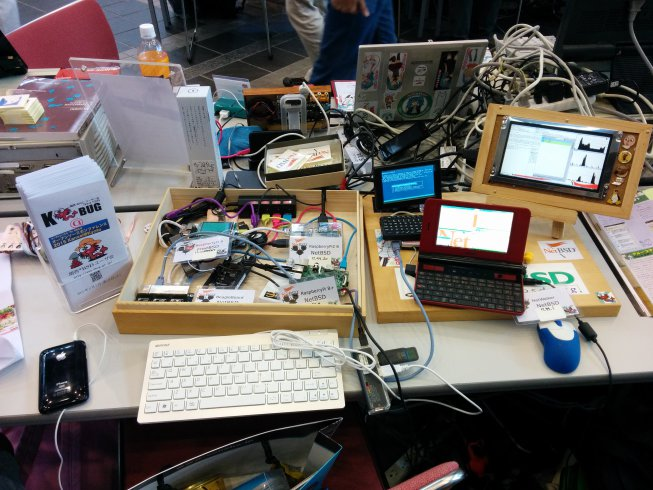

.. figure:: images/OSC2015KyotoNetwork.jpg
   :align: center

.. image:: images/MZTX-PI-EXT.jpg
   :scale: 40%
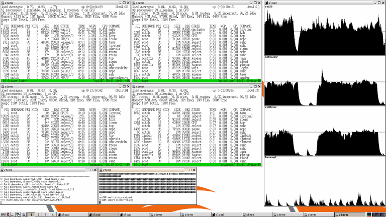
.. image:: images/OSC2015KyotoGirl.png
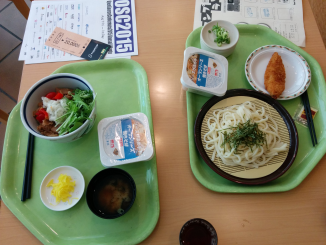

* Gift box cluster 1: distcc distributed compile cluster

  * NetBSD Raspberry Pi B+, 2B, Netwalker

* FreeBSD 11 MZTX-PI-EXT LCD via GPIO

* NetBSD distcc を使った pkgsrc の分散コンパイル環境
* FreeBSD 11-current で MZTX-PI-EXT 表示

JNUG Seminar
^^^^^^^^^^^^^^^^^^^^^^^^^^^^^^^
* NetBSD Guide : http://www.soum.co.jp/~jun/OSC2015kyoto.pdf
* Maintainance before 20 years machine at NetBSD : https://speakerdeck.com/tsutsui/osc2015kyoto-netbsd-and-old-machines

K*BUG 2015/6/27 研究会
--------------------------------
* 公式ページ  : http://www.kbug.gr.jp/events/2015-3rd.html
* 2015/6/27(土) at 株式会社アックス (京都)

発表
^^^^^^^^^^^^^^^^^^^^^^^^^^^^^^^
* Bluetooth LE
* ゆるい pkgsrc の
* LT 的話
  * linux の Bluetooth LE で相談
  * raidframe と壊れたディスク、boot は不可問題
  * Gdev: Open Source の GPGPU Runtime and Driver Software
  * Dell の 4K ディスプレイが FreeBSD で使えへん問題
* 謎言語

K*BUG 2015/5/16 研究会
--------------------------------
* 公式ページ  : http://www.kbug.gr.jp/events/2015-2nd.html
* 2015/5/16(土) at 株式会社アックス (京都)

発表
^^^^^^^^^^^^^^^^^^^^^^^^^^^^^^^
* 今さら sh

K*BUG 2015/3/7 研究会
--------------------------------
* 公式ページ  : http://www.kbug.gr.jp/events/2015-1st.html
* 2015/3/7(土) at グランフロント大阪

発表
^^^^^^^^^^^^^^^^^^^^^^^^^^^^^^^
* うめきた 9F オフィスの紹介
* blink1 について
* FreeBSD で Raspberry PI で GPIO http://qml.610t.org/FreeBSD/raspi_GPIO.html
* 周回遅れの HTTP/2
* iPad に関する軽い話

K*BUG 2015/1/24 研究会
--------------------------------
* 公式ページ  : http://www.kbug.gr.jp/events/16th-plenary.html
* 2015/1/24(土) at 株式会社アックス (京都)

発表
^^^^^^^^^^^^^^^^^^^^^^^^^^^^^^^
* 高専における BSD 化の試みとその顛末
* SmartDoc
* Dake
* ZBSDocs (on SourceForge)
* dump(8) でバックアップ

KOF 2014
----------------------------
* 公式ページ : https://k-of.jp/2014/
* 2014/11/7(金), 8(土) at ATC (大阪)
* K*BUGチラシ: http://sacraya.610t.org/kbug/flyer/flyer-KOF2014.pdf
* togetter by JNUG : https://togetter.com/li/742243
* netbsd-advocacy: "NetBSD machines at KANSAI OPEN FORUM 2014" https://mail-index.netbsd.org/netbsd-advocacy/2014/11/08/msg000672.html

BSD BOF
^^^^^^^^^^^^^^^^^^^^^^^^^^^^^^^
* NetBSD Guide : http://www.soum.co.jp/~jun/KOF2014.pdf
* LUNA at KOF : https://speakerdeck.com/tsutsui/kof-and-luna-at-netbsd-booth

K*BUG 2014/8/23 研究会
--------------------------------
.. * 公式ページ  : http://www.kbug.gr.jp/events/16th-plenary.html
* 2014/8/23(土) at 株式会社アックス (京都)

発表
^^^^^^^^^^^^^^^^^^^^^^^^^^^^^^^
* wide cloud の FreeBSD 8.0 を freebsd-update(8) でupgrade
* Bluetooth LE で遊びはじめた
* tcpcrypt 導入してみた

OSC2014 Kansai@Kyoto
----------------------------
* 公式ページ : https://www.ospn.jp/osc2014-kyoto/
* 2014/8/1(金), 2(土) at Kyoto Research Park (KRP)
* togetter by JNUG : https://togetter.com/li/700617
* netbsd-advocacy: "NetBSD machines at Open Source Conference 2014 Kyoto" https://mail-index.netbsd.org/netbsd-advocacy/2014/08/09/msg000658.html

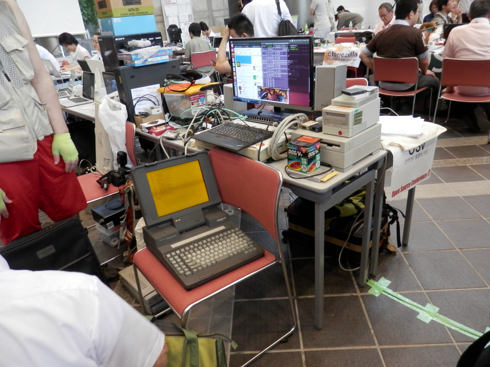
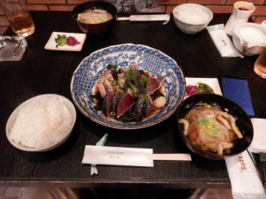
.. image:: images/OSC2014KyotoMeshi2.png
   :scale: 70%

JNUG Seminar
^^^^^^^^^^^^^^^^^^^^^^^^^^^^^^^
* NetBSD Guide : http://www.soum.co.jp/~jun/OSC2014kyoto.pdf
* NetBSD/luna68k event of the past year : https://speakerdeck.com/tsutsui/osc2014-kansai-at-kyoto-netbsd-luna68k-report

K*BUG 2014/6/28 研究会
--------------------------------
.. * 公式ページ  : http://www.kbug.gr.jp/events/16th-plenary.html
* 2014/6/28(土) at グランフロント大阪

発表
^^^^^^^^^^^^^^^^^^^^^^^^^^^^^^^
* Wide Cloud で NetBSD VM が止まってしまって途方に暮れている話
* 国土交通省 CIM と OSS
* ソフトウェアラジオで遊ぼう (rtl2832)
* ssh-agent を OS X の notification center に対応させる
* HMZ-T2 + CubieBoard で OpenGL の wearable virtual reality experience

K*BUG 2014/2/22 研究会
--------------------------------
.. * 公式ページ  : http://www.kbug.gr.jp/events/16th-plenary.html
* 2014/2/22(土) at 株式会社アックス (京都)

K*BUG 2013/12/7 第 15 回定期総会+第 6 回研究会
--------------------------------
.. * 公式ページ  : http://www.kbug.gr.jp/events/16th-plenary.html
* 2013/12/7(土) at 大阪学院大学 2 号館 02-03-02教室
* togetter https://togetter.com/li/600711
  
発表
^^^^^^^^^^^^^^^^^^^^^^^^^^^^^^^
* OSC Kansai@Kyoto 参加報告 
* AWK のあれこれ
* Contao のイベント機能について
* DKMS のはなし

K*BUG 2013/10/19 研究会
--------------------------------
.. * 公式ページ  : http://www.kbug.gr.jp/events/16th-plenary.html
カーネル/VM 勉強会@関西 ごかいめ に合流

K*BUG 2013/8/24 研究会
--------------------------------
.. * 公式ページ  : http://www.kbug.gr.jp/events/16th-plenary.html
* 2013/8/24(土) at グランフロント大阪

発表
^^^^^^^^^^^^^^^^^^^^^^^^^^^^^^^
* *BSD では生きにくい?
* Wintel 支配からの脱獄
* rubygem and pkgsrc

OSC2013 Kansai@Kyoto
----------------------------
* 公式ページ : https://www.ospn.jp/osc2013-kyoto/
* K*BUGチラシ: http://sacraya.610t.org/kbug/flyer/flyer-OSC2013Kyoto.pdf
* Booth page : http://qml.610t.org/FreeBSD/OSC2013Kyoto.html
* Report : http://qml.610t.org/FreeBSD/OSC2013KyotoReport.html
* togetter by K*BUG : https://togetter.com/li/506220
* togetter by JNUG : https://togetter.com/li/542885

.. image:: images/OSC2013KyotoAudio.png
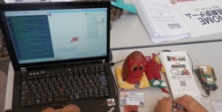
.. image:: images/OSC2013KyotoBoard.png

.. image:: images/OSC2013KyotoMeshi1.png
   :scale: 70%
.. image:: images/OSC2013KyotoMeshi3.png
   :scale: 80%
.. image:: images/OSC2013KyotoMeshi4.png
   :scale: 80%
.. .. image:: images/OSC2013KyotoMeshi2.png

* iCat audio system
* RetroBSD, 2.11BSD on PIC32
* Board, board, board!!

  * Squeak Drive a Car with Gainer compatible board (Design Wave Magazine 2008/05: http://www.cqpub.co.jp/dwm/contents/dwm0126i.htm )
  * OpenGL controller with Coldfire board (Interface 2008/09: http://www.cqpub.co.jp/interface/contents/2008/JA/200809.htm )

JNUG Seminar
^^^^^^^^^^^^^^^^^^^^^^^^^^^^^^^
* NetBSD Guide : http://www.soum.co.jp/~jun/OSC2013kyoto.pdf
* all about OMRON LUNA, Do LUNA68K Dream of mltermic Twitter Sheep? : http://www.ceres.dti.ne.jp/tsutsui/osc2013kyoto/NetBSD-luna68k_mlterm-fb_Twitter.html
* Board, board, board!! : http://qml.610t.org/FreeBSD/OSC2013Kyoto610.html

K*BUG 2013/6/22 研究会
--------------------------------
.. * 公式ページ  : http://www.kbug.gr.jp/events/16th-plenary.html
* 2013/6/22(土) at グランフロント大阪

発表
^^^^^^^^^^^^^^^^^^^^^^^^^^^^^^^
* 会場ナレッジキャピタルに関して
* FreeBSD ports 与太話
* Raspberry Pi の話
* ARM のおはなし

K*BUG 2013/4/20 研究会
--------------------------------
.. * 公式ページ  : http://www.kbug.gr.jp/events/16th-plenary.html
* 2013/4/20(土) at グランフロント大阪

第13回イベント@奈良高専
-----------------------------------------
* 公式ページ : http://qml.610t.org/NNCT/event13.html
* 2013/4/6(土) at 奈良高専

* [Hands on] FreeBSD on PC-BSD 9.1
* [Presentation] Let's enjoy BSD with boards : http://qml.610t.org/FreeBSD/furoku2013.html

.. figure:: images/Event@NNCT13-booth.png
   :align: center
   :scale: 20%

.. image:: images/Event@NNCT13-mutoh.png
.. image:: images/Event@NNCT13-board.png
.. image:: images/Event@NNCT13-book.png
.. image:: images/Event@NNCT13-flyer.png
.. image:: images/Event@NNCT13-presen.png
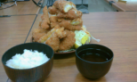

K*BUG 2013/2/16 研究会
--------------------------------
.. * 公式ページ  : http://www.kbug.gr.jp/events/16th-plenary.html
* 2013/2/16(土)

カーネル/VM 勉強会@関西 4 に合流

K*BUG 2012/12/8 第 14 回定期総会+第 7 回研究会
--------------------------------
.. * 公式ページ  : http://www.kbug.gr.jp/events/16th-plenary.html
* 2012/12/8(土) at 株式会社アックス (京都)

発表
^^^^^^^^^^^^^^^^^^^^^^^^^^^^^^^
* 関西 FPGA・DE0 勉強会に行ってきました
* PCI ブリッジのコンフィグレーション
* FreeBSD ports と暮らす
* Contao Open Source CMS でコンテンツ管理

KOF 2012
----------------------------
* 公式ページ : https://2012.k-of.jp/
* 2012/11/9(金), 10(土) at ATC (大阪)

.. figure:: images/KOF2012Booth.png
   :align: center
   :scale: 40%

.. image:: images/KOF2012Penguin.png
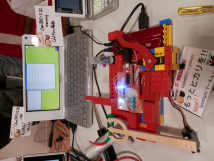
.. image:: images/KOF2012Zaurus.png
.. image:: images/KOF2012Family.png
.. image:: images/KOF2012POV.png

.. image:: images/KOF2012Meshi1.png
.. image:: images/KOF2012Meshi2.png
.. image:: images/KOF2012Meshi3.png
.. image:: images/KOF2012Meshi4.png

* More Lights!! Spotlight daemon  with OpenBSD/i386 x Gainer
* Squeak+Gainer Drive a Car!!
* Coldfire with 3 axis accelerometer board x OpenBSD/zaurus
* K*BUG POV using Arduino compatible board named Japanino http://otonanokagaku.net/japanino/

BSD BoF
^^^^^^^^^^^^^^^^^^^^^^^^^^^^^^^
* NetBSD Guide : http://www.soum.co.jp/~jun/KOF2012.pdf
* Recent BSD I/O : http://qml.610t.org/FreeBSD/BSD_IO_2012_presen.html
* (What is K*BUG? : http://qml.610t.org/FreeBSD/KBUG_KOF2012_presen.html )

K*BUG 2012/10/20 研究会
--------------------------------
.. * 公式ページ  : http://www.kbug.gr.jp/events/16th-plenary.html
* 2012/10/20(土) at グランフロント大阪

発表
^^^^^^^^^^^^^^^^^^^^^^^^^^^^^^^
* NetBSD 6.0R の変更点

K*BUG 2012/8/18 研究会
--------------------------------
.. * 公式ページ  : http://www.kbug.gr.jp/events/16th-plenary.html
* 2012/8/18(土) at 株式会社アックス (京都)

発表
^^^^^^^^^^^^^^^^^^^^^^^^^^^^^^^
* 新しいレノボ PC X230 買いました
* NetBSD on kobo
* FREQUPS UPF F and NetBSD
* Multi Thread Tiny BASIC on PIC32 and RetroBSD
* android のアプリ
* Buffalo ルータのシリアル

OSC2012 Kansai@Kyoto
----------------------------
* 公式ページ : https://www.ospn.jp/osc2012-kyoto/
* 2012/8/3(金), 4(土) at 京都リサーチパーク
* togetter by JNUG : https://togetter.com/li/350035

.. figure:: images/OSC2012KyotoBooth.png
   :align: center
   :scale: 80%

.. image:: images/OSC2012KyotoBoothView.png
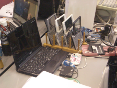
.. image:: images/OSC2012KyotoMyRoom.png

.. image:: images/OSC2012KyotoKBUG.jpg
.. image:: images/OSC2012KyotoRetroBSD.jpg
.. image:: images/OSC2012KyotoBoothBack.png

.. image:: images/OSC2012KyotoMeshi1-1.png
.. image:: images/OSC2012KyotoMeshi3.png

* RetroBSD, 2.11BSD on PIC32
* USL-5P
* High density zaurus rack.
* More Lights!! Spotlight daemon  with NetBSD/hpcmips (WS007SH) x Gainer

* OpenBSD で NAT64
* RetroBSD 展示
* でーもんくんの行進: mini でーもんくん, ダンボールでーもんくん よろこび棒 OSC2012, ...
* K*BUG POV (失敗)
* チラシとでもんむし君シール配布

JNUG Seminar
^^^^^^^^^^^^^^^^^^^^^^^^^^^^^^^
* NetBSD Guide : http://www.soum.co.jp/~jun/OSC2012kyoto.pdf
* Recent NetBSD/luna68k : http://www.ceres.dti.ne.jp/tsutsui/osc2012kyoto/NetBSD-luna68k-updates.html
* Repair power unit of OMRON Luna-II : https://togetter.com/li/354562

第12回イベント@奈良高専
-----------------------------------
* 公式ページ : http://qml.610t.org/NNCT/event12.html
* 2012/7/29(日) at 奈良高専

* [Hands on] Install PC-BSD 
* [Booth] Install BSD at various system
* [Presentation] Use BSD at work by BSD-BA : 

* PC-BSD をはじめよう!! http://qml.610t.org/FreeBSD/PCBSD.html
* K*BUG をはじめよう!!
* おしごと BSD を推めよう http://www.bsd-ba.org/
* 展示: RetroBSD, Physical Computing, BSD 書籍

.. image:: images/Event@NNCT-all.png
.. image:: images/Event@NNCT-dreamcast.png
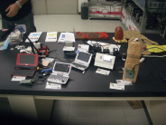
.. image:: images/Event@NNCT-MobileGear.png
.. image:: images/Event@NNCT-PenCentra.png
.. image:: images/Event@NNCT-Fonera.png
.. .. image:: images/Event@NNCT-Meshi.png

K*BUG 2012/6/23 研究会
--------------------------------
.. * 公式ページ  : http://www.kbug.gr.jp/events/16th-plenary.html
* 2012/6/23(土) at グランフロント大阪

K*BUG 2012/4/21 研究会
--------------------------------
.. * 公式ページ  : http://www.kbug.gr.jp/events/16th-plenary.html
* 2012/4/21(土) at 株式会社アックス (京都)

発表
^^^^^^^^^^^^^^^^^^^^^^^^^^^^^^^
* Sony NEWS の MO をサルベージする
* USB memstick で使う FreeBSD
* n12i さんちのお話
* FreeBSD ports と暮らす (2) - ports 作成編
* FreeBSD ports と暮らす (3) - redports を使おう
* FreeBSD port lang/squeak4.4.7-2375への道 http://qml.610t.org/FreeBSD/squeak4_4_7_2375.html
* BSD お仕事の会のお話 (BSD-BA)

K*BUG 2012/2/18 研究会
--------------------------------
.. * 公式ページ  : http://www.kbug.gr.jp/events/16th-plenary.html
* 2012/2/18(土) at 株式会社アックス (京都)

発表
^^^^^^^^^^^^^^^^^^^^^^^^^^^^^^^
* FreeBSD ports と暮らす (1) - github 編

K*BUG 2011/12/17 第 13 回定期総会+第 5 回研究会
--------------------------------
.. * 公式ページ  : http://www.kbug.gr.jp/events/16th-plenary.html
* 2011/12/17(土) at グランフロント大阪

発表
^^^^^^^^^^^^^^^^^^^^^^^^^^^^^^^
* USB ガイガーカウンターをつなぐ＋ USB サウンド I/F をつくる＋ USB でデジカメ制御
* はじめての NetBSD
* dnssec authenicated https
* 2011 K-OF K*BUG 出展まとめとこれまでやってみて考えたこと

KOF 2011
----------------------------
* 公式ページ : https://k-of.jp/2011/
* 2011/11/11(金), 12(土) at ATC
* togetter by JNUG : https://togetter.com/li/213724

.. image:: images/KOF2011USL-5P.JPG
   :scale: 10%
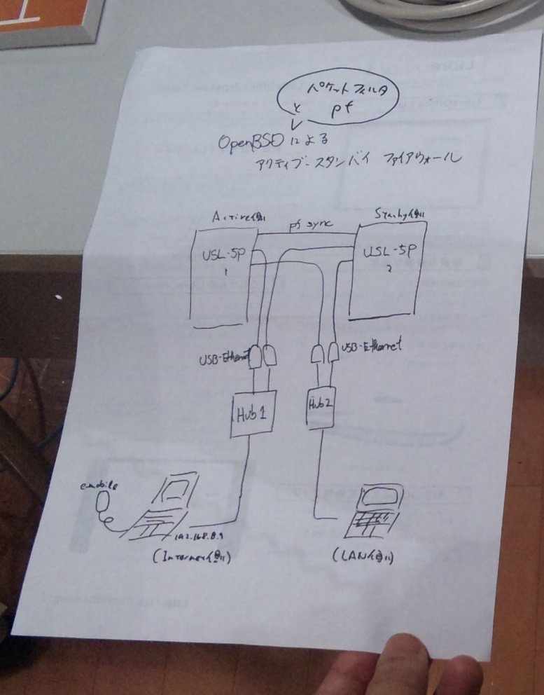
.. image:: images/KOF2011Booth.JPG
   :scale: 15%

* Active/Standby Firewall with 2 OpenBSD/landisk at USL-5P : http://www.rururu.org/fswiki/wiki.cgi?page=OpenBSD%2Flandisk%A4%C7Active%2DStandby+Firewall
* {Net, Free, Open DragonFly}BSD at NetBSD/xen 

BSD BoF
^^^^^^^^^^^^^^^^^^^^^^^^^^^^^^^
* NetBSD Guide : http://www.soum.co.jp/~jun/KOF2011.pdf
* Why enigmatic machines? by @tsutsuii : http://www.ceres.dti.ne.jp/tsutsui/kof2011/Why-enigmatic-machines.html
* pkgsrc

K*BUG 2011/10?/ 研究会
--------------------------------

K*BUG 2011/8?/ 研究会
--------------------------------

OSC2011 Kansai@Kyoto
----------------------------
* 公式ページ : https://www.ospn.jp/osc2011-kyoto/
* 2011/7/15(金), 16(土) at KRP
* K*BUGチラシ: http://sacraya.610t.org/kbug/flyer/flyer-OSC2011Kyoto.pdf

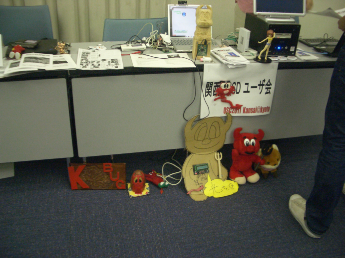

.. image:: images/OSC2011KyotoBuild.png
   :scale: 75%
.. image:: images/OSC2011KyotoVM.png
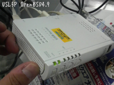
.. image:: images/OSC2011KyotoJoyStick.png
.. image:: images/OSC2011KyotoDesktop.png
.. image:: images/OSC2011KyotoGion1.png

* OpenBSD/landisk USL-5P
* {Net, Free, Open, DragonFly}BSD at NetBSD/xen 
* Visualization NetBSD and FreeBSD build process.
* Squeak+Gainer Drive a Car!! with FreeBSD.
* More Light!! swing daemon based on Arduino.

JNUG Seminar
^^^^^^^^^^^^^^^^^^^^^^^^^^^^^^^
* NetBSD Guide : http://www.soum.co.jp/~jun/OSC2011kyoto.pdf
* "NetBSD/m68k will never die!" :  http://www.ceres.dti.ne.jp/tsutsui/osc2011kyoto/NetBSD-m68k-will-never-die.html

K*BUG 2011/6/18 研究会
--------------------------------
.. * 公式ページ  : http://www.kbug.gr.jp/events/16th-plenary.html
* 2011/6/18(土) at 株式会社アックス (京都)

発表
^^^^^^^^^^^^^^^^^^^^^^^^^^^^^^^
* 小ネタ 3 つ
  * mount smbfs ではまった話
  * mount smbfs / fuse smbnetfs が遅い
  * 10 日に 1 回 panic する話
* LTE のドライバー
* pkgsrc-2011Q2 について
* What Operating System Has Crashed Here?
* OpenSSH の謎を学ぶ
* Interactive shell for blockdiag http://interactive.blockdiag.com/ の可能性
* 懇親会@んまい

OSC2011 Kansai@Kobe
--------------------------------
.. * 公式ページ  : http://www.kbug.gr.jp/events/16th-plenary.html
* 2011/4/16(土) at 

K*BUG 2011/2/19 研究会
--------------------------------
.. * 公式ページ  : http://www.kbug.gr.jp/events/16th-plenary.html
* 2011/2/19(土) at グランフロント大阪

K*BUG 2010/12/11  第 12 回定期総会+第 6 回研究会
--------------------------------
.. * 公式ページ  : http://www.kbug.gr.jp/events/16th-plenary.html
* 2010/12/11(土) at グランフロント大阪 株式会社アックス (京都)

発表
^^^^^^^^^^^^^^^^^^^^^^^^^^^^^^^
* 定期総会
* RockTube のファーム
* ZFS Root のはまりどころ
* DNSSEC 対応レゾルバを 10 分で用意する
* freebsd-update で 7.1 から upgrade してみた
* clang/LLVM の小ネタ
* 夏の怪談その後 (disk が治った!!)
* KOF2011 K*BUG ブース報告

KOF 2010
----------------------------
* 公式ページ : https://k-of.jp/2010/
* 2010/11/5(金), 6(土) at ATC

.. figure:: images/KOF2009Booth.png
   :align: center
   :scale: 60%

* ユビキタスな K*BUG の祭典。
* NetBSD/xen (Dom0) で {Net, Open, DragonFly}BSD (DomU)
  * Live on air!! CentOS and Gentoo/Dragonfly (DomU)
  * FreeBSD (DomU) is not work orz.
* OpenBSD/landisk on USL-5P で Active/Stanby FW (pf + CARP)
* OpenBSD/zaurus by NBUG
* Song with us, OpenBSD release songs!! (endless)
* 64bit の 20 年 at 中村ブース (K*BUG メンバー)
* Linux で DAW at 中村ブース (K*BUG メンバー)
  
K*BUG 2010/9/11 研究会
--------------------------------
.. * 公式ページ  : http://www.kbug.gr.jp/events/16th-plenary.html
* 2010/9/11(土) at 株式会社アックス (京都)

K*BUG 2010/7/24 研究会
--------------------------------
.. * 公式ページ  : http://www.kbug.gr.jp/events/16th-plenary.html
* 2010/7/24(土) at 神戸

OSC2010 Kansai@Kyoto
----------------------------
* 公式ページ : https://www.ospn.jp/osc2010-kyoto/
* 2010/7/9(金), 10(土) at kcg.edu: http://www.kcg.ac.jp/
* K*BUGチラシ: http://sacraya.610t.org/kbug/flyer/flyer-OSC2010Kyoto.pdf

Booth
^^^^^^^^^^^^^^^^^^^^^^^^^^^^^^^
* Fastest script for installing FreeBSD.
* Try installation NetBSD/bebox, but fail...

K*BUG 2010/5/15 研究会
--------------------------------
.. * 公式ページ  : http://www.kbug.gr.jp/events/16th-plenary.html
* 2010/5/15(土) at 株式会社アックス (京都)

発表
^^^^^^^^^^^^^^^^^^^^^^^^^^^^^^^
* ArecX の話　
* SDIO な無線 LAN
* syslog(3) 話
* SDIO の話、再び
* ハードディスク買いました
* aristanetworks.com の話

OSC2010 Kansai@Kobe
----------------------------
* 公式ページ : https://www.ospn.jp/osc2010-kobe/
* 2010/3/13(土) at Kobe Industrial Promotion Center
* K*BUGチラシ: http://sacraya.610t.org/kbug/flyer/flyer-OSC2010Kobe.pdf

JNUG Seminar
^^^^^^^^^^^^^^^^^^^^^^^^^^^^^^^
* "making of SMC_TT - VME Ethernet using ISA NIC for ATARI TT030" by @tsutsuii : http://www.ceres.dti.ne.jp/tsutsui/osc2010kobe/SMC_TT-OSC2010Kobe.html
* Ethernet card SMC_TT for ATARI TT030 :https://togetter.com/li/76769

K*BUG 2010/3/6 研究会
--------------------------------
.. * 公式ページ  : http://www.kbug.gr.jp/events/16th-plenary.html
* 2010/3/6(土) at 大阪

発表
^^^^^^^^^^^^^^^^^^^^^^^^^^^^^^^
* Virtual Box on FreeBSD 8
* qemu によるプログラム実行
* pkgsrc の近況 (ちょっとだけ)
* まっちゃ139の使い回しのTYPOlightのセキュリティの話

K*BUG 2010/1/23 研究会
--------------------------------
.. * 公式ページ  : http://www.kbug.gr.jp/events/16th-plenary.html
* 2010/1/23(土) at 株式会社アックス (京都)

発表
^^^^^^^^^^^^^^^^^^^^^^^^^^^^^^^
* 何となく IPv6 と NTT のサービス
* C 言語によるラムダ関数 (Mac OS 10.6)
* NetBSD current の罠 (Ruby)
* llvm 話

K*BUG 2009/12/12  第 11 回定期総会+研究会
--------------------------------
.. * 公式ページ  : http://www.kbug.gr.jp/events/16th-plenary.html
* 2009/12/12(土) at 大阪

KOF 2009
----------------------------
* 公式ページ : https://k-of.jp/2009/

* 2009/11/6(金), 7(土) at ATC
* K*BUGチラシ: http://sacraya.610t.org/kbug/flyer/flyer-KOF2009.pdf

.. figure:: images/KOF2009Booth.png
   :align: center
   :scale: 60%

* NetBSD なひととき
* 展示
  * NetBSD/mac68k on LC475Upgrade
  * 恒例、色々なオールドマシンが BSD で動く!!
  * 光の方へ!! Arduino デーモン君
  * 趣味の木彫の世界

K*BUG 2009/9/12 研究会
--------------------------------
.. * 公式ページ  : http://www.kbug.gr.jp/events/16th-plenary.html
* 2009/9/12(土) at 大阪

K*BUG 2009/7/25 研究会
--------------------------------
.. * 公式ページ  : http://www.kbug.gr.jp/events/16th-plenary.html
* 2009/7/25(土) at 株式会社アックス (京都)

発表
^^^^^^^^^^^^^^^^^^^^^^^^^^^^^^^
* 家計簿をつけよう
* 「BPG4 で遊ぼう」2
* 番外:酔っぱらいのための割り勘計算

OSC2009 Kansai@Kyoto
----------------------------
* 公式ページ : https://www.ospn.jp/osc2009-kansai/
* 2009/7/10(金), 11(土) at kcg.edu: http://www.kcg.ac.jp/

Booth
^^^^^^^^^^^^^^^^^^^^^^^^^^^^^^^
* LED CPU meter
* BSD daemon statue gadgets
* USL-5P+USB LCD(landisk)
* bcbenchチキンレース http://www.yagoto-urayama.jp/∼oshimaya/nbug/etc/bench/bcbench.html
* 夏の京都恒例:電力測定

K*BUG 2009/5/16 研究会
--------------------------------
.. * 公式ページ  : http://www.kbug.gr.jp/events/16th-plenary.html
* 2009/5/16(土) at 神戸

発表
^^^^^^^^^^^^^^^^^^^^^^^^^^^^^^^
* モダン DNS 入門
* Typolight2.7 の紹介
* llvm/clang で FreeBSD
* ベーグルボードと Interface 付属ボードもってきたよ回覧
* モバイルギアで NetBSD

Nico-Tech: Kyoto Meeting (NK:M)
--------------------------------
* 公式ページ : http://wiki.nicotech.jp/nico_tech/index.php?NTM2%2F%E9%96%A2%E8%A5%BF
* 2009/3/21(土) at Saiin-Kasuga shrine (京都) http://www.kasuga.or.jp/
* Report : http://qml.610t.org/squeak/mutoh_20090321.html
* Presentation : http://www.nicovideo.jp/watch/sm6562064 (7:00-9:40)

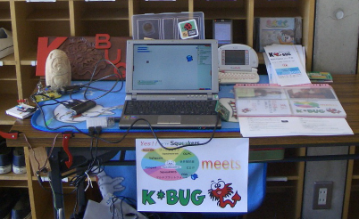
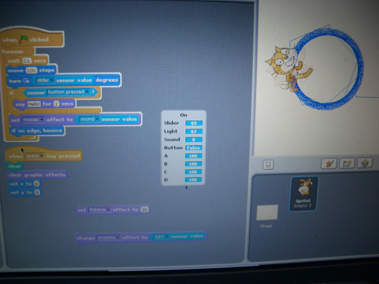
.. image:: images/NKM2009Make.png
   :scale: 30%

* Design Wave Magazine + Squeak + FreeBSD = Drive a Car!!
* PicoBoard + Scratch + FreeBSD = まわる猫
* Squeak+Gainer の世界
* 歴代世界聴診器集合
* PDA de Squeak

* Squeak-ja meets K*BUG
* On FreeBSD

  * Squeak+Gainer Drive a Car!!
  * Scartch + PicoBoard
  * Servo motor daemon's tail  drive by USB audio device

* WorldStethoscope : http://swikis.ddo.jp/WorldStethoscope/6
* Squeak on Pocket Post Pet (Windows CE)

K*BUG 2009/3/7 研究会
--------------------------------
.. * 公式ページ  : http://www.kbug.gr.jp/events/16th-plenary.html
* 2009/3/7(土) at 大阪

K*BUG 2009/1/24 研究会
--------------------------------
.. * 公式ページ  : http://www.kbug.gr.jp/events/16th-plenary.html
* 2009/1/24(土) at 株式会社アックス (京都)

発表
^^^^^^^^^^^^^^^^^^^^^^^^^^^^^^^
* RemotePad for iPhone の開発について http://www.tenjin.org/RemotePad/
* FreeBSD の setfib について
* FreeBSD での gainer の利用について
* Serial知りはる?知ってはる? http://qml.610t.org/FreeBSD/Serial2008.html
* Gainer mini と C での使い方
* uipaq0 ネタ
* NetBSD の time t 64bit 化について
* Tiger の FSEvents API について

K*BUG 2008/12/6 第 10 回定期総会+研究会
--------------------------------
.. * 公式ページ  : http://www.kbug.gr.jp/events/16th-plenary.html
* 2008/12/6(土) at 大阪

KOF 2008
----------------------------
* 公式ページ : https://k-of.jp/2008/
* 2008/11/7(金), 8(土) at ATC (大阪)
* K*BUGチラシ: http://sacraya.610t.org/kbug/flyer/flyer-KOF2008.pdf

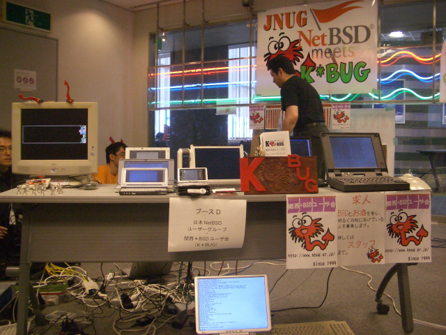

.. image:: images/KOF2008daemon.png
.. image:: images/KOF2008USL-5P.png
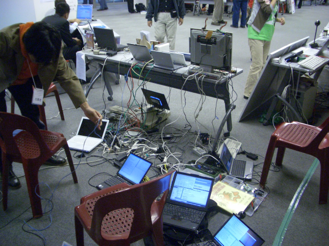
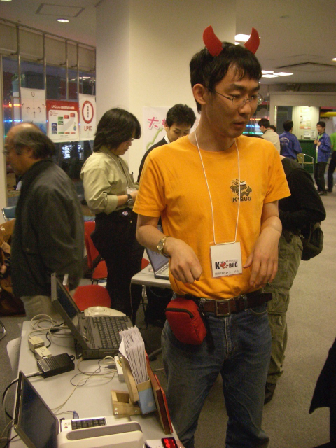
.. image:: images/KOF2008Meshi1.png
.. image:: images/KOF2008Meshi2.png

* OpenBSD/landisk at USL-5P
* Devices: Servo motor deive deamon's tails using USB audio, Squeak+Gainer http://www.yengawa.com/squeak_gainer
* NetBSD なひととき
* 展示
  * 恒例、色々なオールドマシンが BSD で動く!!
  * USL-5P/NetBSD によるLED 照明システム
  * NetBSD uvideo で遊ぼう
  * Squeak+Gainer/FreeBSD
  * 趣味の木彫看板

K*BUG 2008/9/6 研究会
--------------------------------
.. * 公式ページ  : http://www.kbug.gr.jp/events/16th-plenary.html
* 2008//(土) at 大阪

発表
^^^^^^^^^^^^^^^^^^^^^^^^^^^^^^^
* iPod touch を使った何か
* はじめよう Network Audio
* perl でログインプロキシ
* Typolight WebCMS の概要
* ぼくのなつやすみ 2008(未完) http://qml.610t.org/FreeBSD/SummerVacation2008.html
* 懇親会: 四季彩

OSC2008 Kansai@Kyoto
----------------------------
* 公式ページ : https://www.ospn.jp/osc2008-kansai/
* 2008/7/18(金), 19(土) at kcg.edu: http://www.kcg.ac.jp/

.. figure:: images/OSC2008KyotoBooth.png
   :scale: 70%
   :align: center

.. image:: images/OSC2008KyotoIshihara.png
.. image:: images/OSC2008KyotoBag.png
.. image:: images/OSC2008KyotoAlpha.png
.. image:: images/OSC2008KyotoMiku.png
.. image:: images/OSC2008KyotoMutoh.png
.. image:: images/OSC2008KyotoMen.png
.. image:: images/OSC2008KyotoFlyer.png

.. image:: images/OSC2008KyotoKonomi.png
.. image:: images/OSC2008KyotoYakiRamen.png
.. image:: images/OSC2008KyotoCheese.png
.. .. image:: images/OSC2008KyotoMeshi1.png

* BSD for various machines: sgi O2, BeBox(not work), Zaurus, ML115, Fonera, NetBSD/hpcmips, hpcsh, evbmips, alpha (digital Alpha Multia)
* Miku Hatsune paper doll with Six servo moters controlled by USB audio
* Devices: USB one-seg tuner, UHID based themal sensor USB-RH https://strawberry-linux.com/catalog/items?code=52002

* BeBox (NetBSD 化失敗)
* NetBSD/O2
* ネギ降りサーボ + FT232を使った LCD パネル
* 魅惑のえびじゅんコレクション
* Squeak/MGL2@NetBSD/hpcmips
* bcbench チキンレース
* 夏の京都恒例:電力測定
  
K*BUG 2008/7/13 研究会
--------------------------------
.. * 公式ページ  : http://www.kbug.gr.jp/events/16th-plenary.html
* 2008/7/13(土) at 株式会社アックス (京都)

K*BUG 2008/5/17 研究会
--------------------------------
.. * 公式ページ  : http://www.kbug.gr.jp/events/16th-plenary.html
* 2008/5/17(土) at 株式会社アックス (京都)

発表
^^^^^^^^^^^^^^^^^^^^^^^^^^^^^^^
* ZFS
* NanoBSD 紹介
* ThinkPad X61 の Suspend/Resume について
* FT245 で遊ぼう
* ワンセグのお話
* Debian の OpenSSL 関連
* 懇親会:んまい

K*BUG 2008/3/15 研究会
--------------------------------
.. * 公式ページ  : http://www.kbug.gr.jp/events/16th-plenary.html
* 2008/3/15(土) at 大阪

発表
^^^^^^^^^^^^^^^^^^^^^^^^^^^^^^^
* iPod jailbreak
* iSCSI 関連
* freebsd-update
* USB 地デジ

K*BUG 2008/2/9 研究会
--------------------------------
.. * 公式ページ  : http://www.kbug.gr.jp/events/16th-plenary.html
* 2008/2/9(土) at 株式会社アックス (京都)

発表
^^^^^^^^^^^^^^^^^^^^^^^^^^^^^^^
* Life with dtrace
* サーバのヘッドレス運用について
* 負け組日記 FreeBSD/amd64
* kurobox-pro + LCD pro
* 最近の (BSD での)Squeak http://qml.610t.org/squeak/Squeak2007.html
* 音声で遊ぼう
* おみやげ: HD-30 どこでもドライバー
* 新年会:んまい

K*BUG 2007/12/8  第 10 回定期総会+研究会
--------------------------------
.. * 公式ページ  : http://www.kbug.gr.jp/events/16th-plenary.html
* 2007/12/8(土) at 大阪

KOF 2007
--------------------------------
* 公式ページ : https://k-of.jp/2007/
* 2007/11/9(金), 10(土) at ATC

.. image:: images/KOF2007Booth.png
   :scale: 9%
.. image:: images/KOF2007Board.png
   :scale: 9%
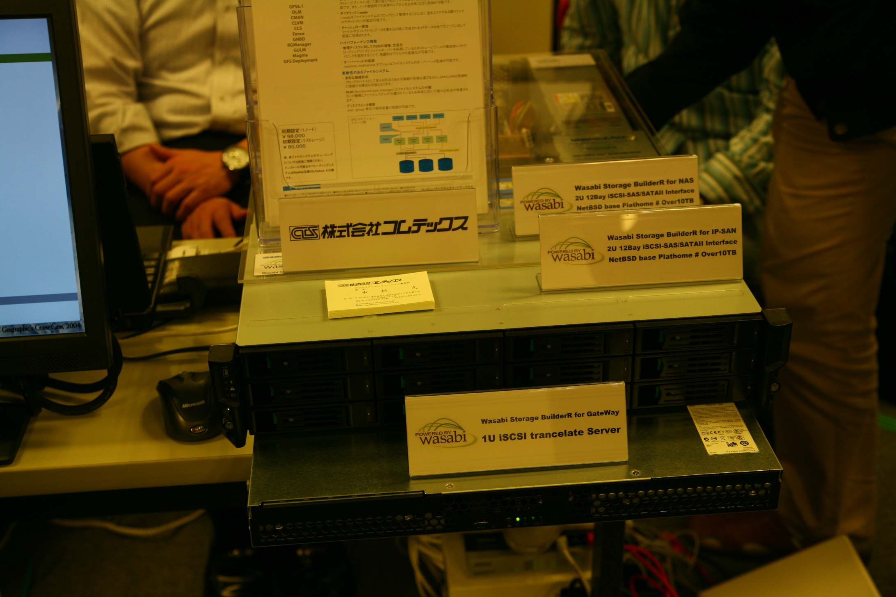

K*BUG 2007// 研究会
--------------------------------
.. * 公式ページ  : http://www.kbug.gr.jp/events/16th-plenary.html
* 2007//(土) at 株式会社アックス (京都)

発表
^^^^^^^^^^^^^^^^^^^^^^^^^^^^^^^

第11回イベント@奈良高専
-----------------------------------
* 公式ページ : http://sacraya.610t.org/www.openedu.org/ja/event/nnct11/
* 2007/3/31(土) at 奈良高専
* Report : http://qml.610t.org/NNCT/report_event_11th.html

.. image:: images/Event@NNCT11-OLPC.png
.. image:: images/Event@NNCT11-GRUB.png
.. .. image:: images/Event@NNCT11-WiFi.png
.. image:: images/Event@NNCT11-RoboCup.png
.. image:: images/Event@NNCT11-cherry.png
.. image:: images/Event@NNCT11-meshi1.png
.. image:: images/Event@NNCT11-meshi2.png

* Introduction NNCT Information Engineering Computer Room.
* FreeBSD ports: RoboCup 2D simulator
* Create Squeak Dual Boot CDROM : http://qml.610t.org/squeak/squeak_cdrom.html

KOF 2006
--------------------------------
* 公式ページ : https://k-of.jp/2006/
* 2006/11/17(金), 18(土) at ATC

.. image:: images/KOF2006Booth.png
   :scale: 20%
.. image:: images/KOF2006Book.png
   :scale: 20%
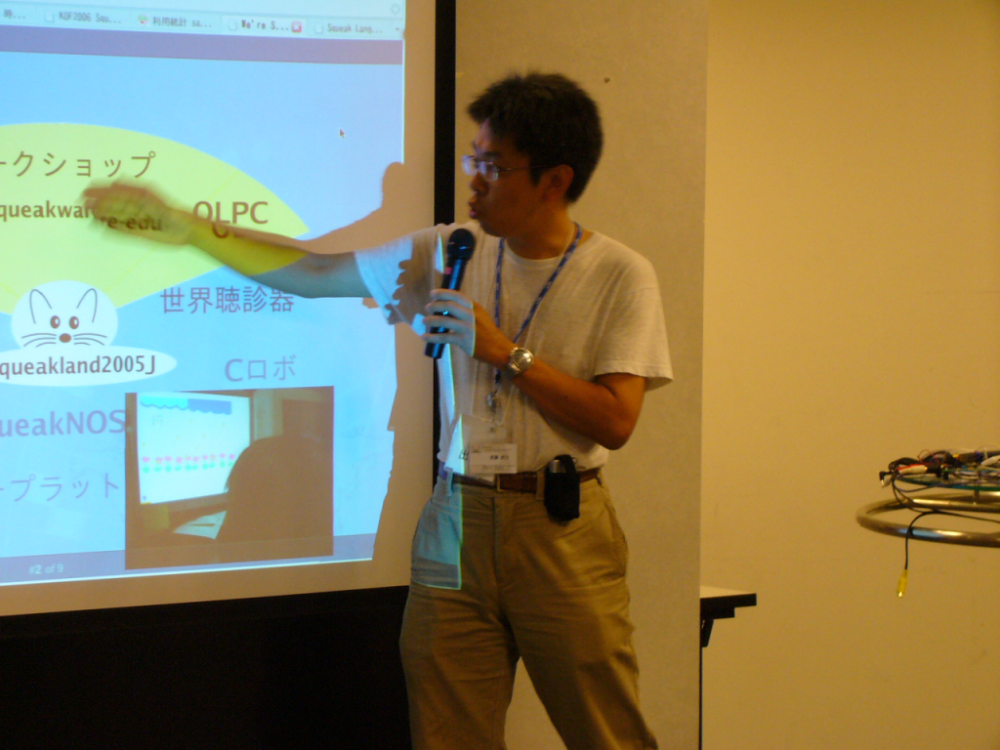

* On FreeBSD

  * Croquet: https://en.wikipedia.org/wiki/Croquet_Project
  * Squeak + WorldStethoscope
  * Moeru Squeak ( http://moesuku.ofg.jp/ ) on ONScripter ( https://onscripter.osdn.jp/onscripter.html ) 

第3回イベント@奈良高専
-----------------------------------
* 2002/7/20(土) at 奈良高専
* Report  published at FreeBSD Press No12: http://sacraya.610t.org/Press/No12/nnct-event/

発表
^^^^^^^^^^^^^^^^^^^^^^^^^^^^^^^
* Report: xcast6 online meeting
* Postfix
* One chip microcomputer AVR
* Recovery 48 computers using PXEBOOT in 30 minutes
* Document using SmartDoc
* About DocBook/SGML

第1回イベント@奈良高専
-----------------------------------
* 2001/8/4(土) at 奈良高専
* Report published at FreeBSD Press No7: http://sacraya.610t.org/Press/No7/bugs/

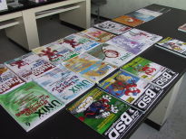
.. image:: images/Event@NNCT1-working.png
.. image:: images/Event@NNCT1-poster.png
.. image:: images/Event@NNCT1-machines.jpg

* BSD for various machines.

  * NetBSD/hpcmips: NEC MobileGearII 330R, Fujitsu PenCentura130, PocketPostpet 
  * NetBSD/sun3: Sun 3/60
  * NetBSD/sun3x: Sun 3/80
  * NetBSD/mac68k: Macintosh IIcx
  * NetBSD/news68k: Sony NEWS NWS-831,PWS-1550,NWS-1720

* Install hands on
* BSD media in Japan

* Print version PDF is at http://sacraya.610t.org/kbug/book/booth/KBUGBoothGuide-print.pdf
* Valid link PDF is at http://sacraya.610t.org/kbug/book/booth/KBUGBoothGuide.pdf
* HTML version is at http://sacraya.610t.org/kbug/book/booth/singlehtml/
* Source is at https://github.com/610t/kbug/tree/master/book/booth/

.. image:: images/QRcodePDF-print.png
   :scale: 80%
.. image:: images/QRcodeWWW.png
   :scale: 80%

.. csv-table::
   :align: center

   2018/6/,	AsiaBSDCon 2017 edition

