.. K*BUG Booth Guide documentation master file, created by
   sphinx-quickstart on Sat Feb 11 09:29:46 2017.
   You can adapt this file completely to your liking, but it should at least
   contain the root `toctree` directive.

Kansai *BSD Users Group event guide
=============================================

* http://www.kbug.gr.jp/

.. toctree::
   :maxdepth: 2
   :caption: Contents:

Kansai *BSD Users Group 2017/2/11 meeting
==========================================
* Official page: http://www.kbug.gr.jp/events/2017-1st.html
* Facebook: https://www.facebook.com/events/920179428083721/

   Kansai *BSD Users Group 2017/2/11 Booth

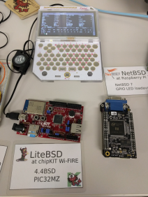
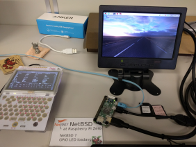

OSC2016 Kyoto
=====================
* Official page: https://www.ospn.jp/osc2016-kyoto/
* Flyer: http://sacraya.610t.org/kbug/flyer/flyer-OSC2016Kyoto.pdf
* Report(in Japanese): http://qml.610t.org/FreeBSD/OSC2016Kyoto.html

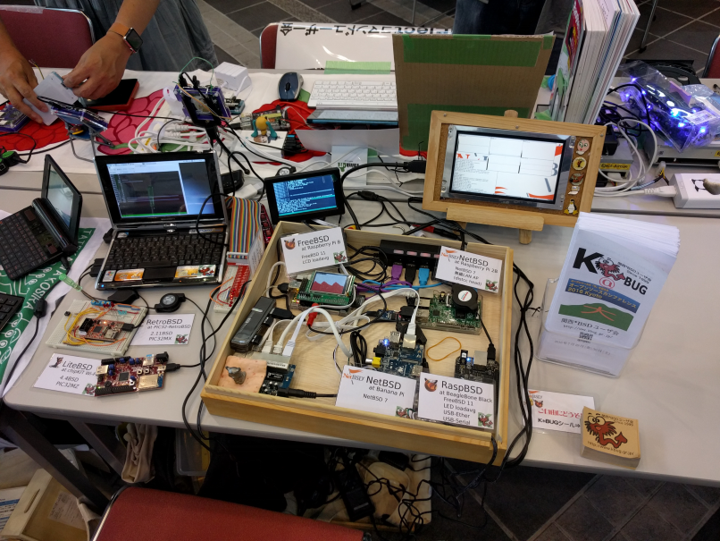

   OSC2016 Kyoto booth

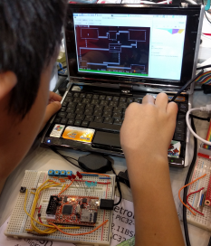
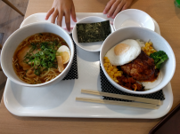

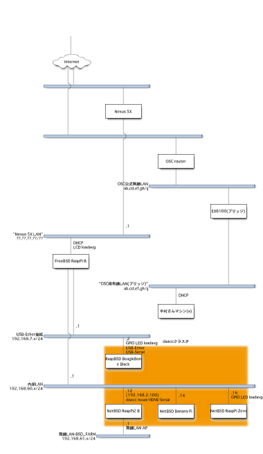

OSC2015 Kansai@Kyoto
=====================
* Official Page: https://www.ospn.jp/osc2015-kyoto/
* Report (in Japanese): http://qml.610t.org/FreeBSD/OSC2015Kyoto.html
.. figure:: images/OSC2015KyotoBooth.jpg

   OSC2015 Kansai@Kyoto booth

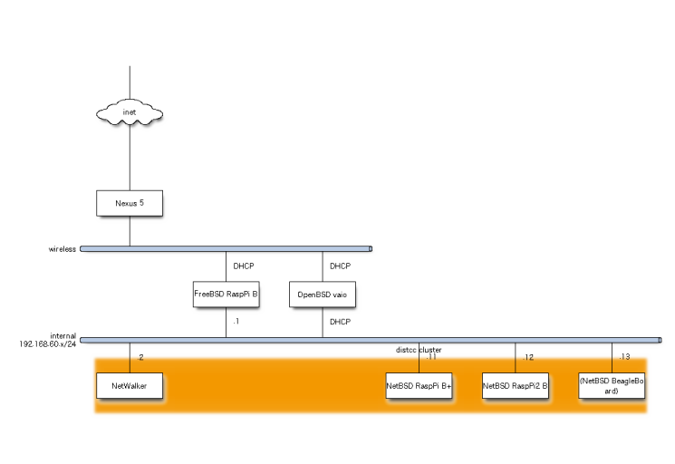

   OSC2015 Kansai@Kyoto network

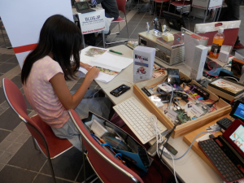

OSC2013 Kansai@Kyoto
=====================
* Official page: https://www.ospn.jp/osc2013-kyoto/
* Booth page (in Japanese): http://qml.610t.org/FreeBSD/OSC2013Kyoto.html
* Report (in Japanese): http://qml.610t.org/FreeBSD/OSC2013KyotoReport.html

OSC2013 Kansai@Kyoto booth
---------------------------
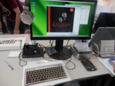
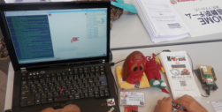
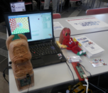

Wonderful meal
------------------
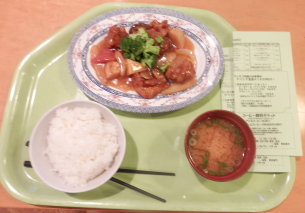
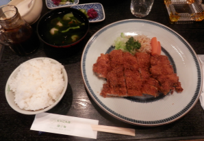
