.. K*BUG Booth Guide documentation master file, created by
   sphinx-quickstart on Sat Feb 11 09:29:46 2017.
   You can adapt this file completely to your liking, but it should at least
   contain the root `toctree` directive.

.. header:: Kansai * BSD Users Group Event Guide
.. footer:: http://sacraya.610t.org/kbug/book/booth/KBUGBoothGuide.pdf

.. |Japanese| image:: images/Japan-flag.png 

What is Kansai * BSD Users Group?
==========================================
Kansai * BSD Users Group (K*BUG) is regional BSD Users Group at Kansai area in Japan.
Kansai area has many cities including Osaka, Kyoto, Kobe, Nara and so on.

Our web page is |Japanese| http://www.kbug.gr.jp/ .

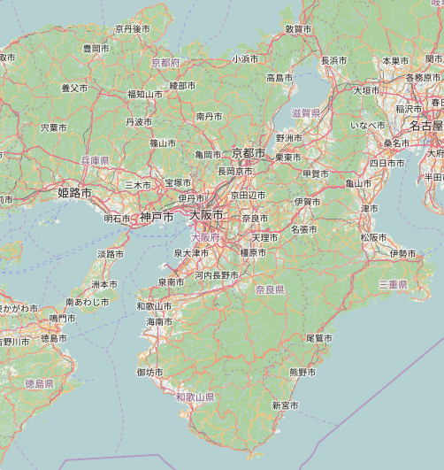

   Kansai area (c) OpenStreetMap contributors

.. Policy
.. --------

Daemon-Mushi (でもんむし)
---------------------------
Deamon-Mushi (でもんむし) is a mascot character for K*BUG.
Inkscape SVG source file is at http://sacraya.610t.org/kbug/logo/ .

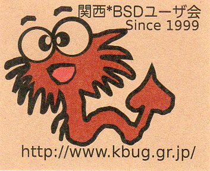

Interest
---------
* BSD: FreeBSD (PC-BSD), NetBSD, OpenBSD, DragonlyBSD, (macOS?), (iOS??)...
* arch: i386, amd64, arm (Raspberry Pi), macppc, landisk, zaurus, wzero3, hpcmips, netwalker, ipaq, fonera, vax, ...
* kernel hack: kernel module, BLE, serial driver, ...
* New technology: DTrace, ZFS, ...
* Software package: FreeBSD ports, pkgsrc, ...
* Security: pkg audit, maintainance my server, 
* Education: Scratch, Squeak, ...
* Languages: Prolog, Lisp, awk, Squeak, Scratch, ...
* Hardware: UPS, HDD, Server, Bluetooth, GPIO, ...
* Physical Computing: Gainer (gainerm-lib), Arduino, ...
* Electronic work: hacked USB audio servo controller, electric circuit with magazine, ...
* misc: OpenCV, ContaoCMS, ...
* Woodworking: K*BUG sign, daemon wood carving, ...
* Drinking party after every meeting

Meeting
--------
We hold meeting every 2 monthes.
Meeting schedule is |Japanese| http://www.kbug.gr.jp/workshops.html .

We use these meeting rooms:

* AXE Inc. meeting room at Kyoto: http://www.axe-inc.co.jp/english/index.html
* Grand front Osaka: https://www.grandfront-osaka.jp/multilingulal/

Event activities
------------------
We open booth at these events:

* Open Source Conference |Japanese|: http://ospn.jp/
* Kansai Open Forum |Japanese|: https://k-of.jp/
* Event@NNCT |Japanese|: http://qml.610t.org/NNCT/event.html

AsiaBSDCon 2017
==========================================
* Official page: https://2017.asiabsdcon.org/
* 2017/3/9(Wed)-12(Sun) at Tokyo University of Science
* Facebook: https://www.facebook.com/events/1718621151740857/
* togetter: https://togetter.com/li/1084357

Kansai * BSD Users Group 2017/2/11 meeting
==========================================
* Official page |Japanese| : http://www.kbug.gr.jp/events/2017-1st.html
* 2017/2/11(Sat) at Axe inc (Kyoto)
* Facebook |Japanese|: https://www.facebook.com/events/920179428083721/
* togetter |Japanese|: https://togetter.com/li/1078967

.. figure:: images/Booth.png
   :align: center

.. image:: images/RetroBSD.png
.. image:: images/LiteBSD.png
.. image:: images/RaspberryPiZero.png

* RetroBSD: 2.11BSD on MIPS(PIC32MX). The board name is Pinguino-RetroBSD.
* LiteBSD: 4.4BSDLite on MIPS(PIC32MZ). The board name is Chipkit WiFire. Serial Console is Pocket C.H.I.P.
* Raspberry Pi Zero

Presentations
---------------------------------------
* IOzone graph with Excel
* K*BUG @ OSC2015 |Japanese|: http://qml.610t.org/FreeBSD/OSC2015Kyoto.html
* Raspberry Pi 3 on FreeBSD
* Scratch on BSD |Japanese|: http://qml.610t.org/FreeBSD/ScratchBSD.html
* iOS with wired LAN

Open Source Conference (OSC) 2017 Osaka
=========================================
* Official page |Japanese|: https://www.ospn.jp/osc2017-osaka/
* 2017/1/27(Fri), 28(Sat) at Osaka Sansokan
* K*BUG flyer (not published) |Japanese|: http://sacraya.610t.org/kbug/flyer/flyer-OSC2017Osaka.pdf
* togetter by JNUG |Japanese|: https://togetter.com/li/1075115
* netbsd-advocacy: "NetBSD machines at Open Source Conference 2017 Osaka" http://mail-index.netbsd.org/netbsd-advocacy/2017/01/28/msg000727.html

JNUG Seminar
-------------
* NetBSD Guide |Japanese|: http://www.soum.co.jp/~jun/OSC2017osaka.pdf
* PC6001 emulator PC6001VX on NetBSD + pkgsrc by @tsutsui |Japanese|: https://speakerdeck.com/tsutsui/osc2017-osaka-pc-6001-emulator-on-netbsd-and-pkgsrc

KOF 2016
=====================
* Official page |Japanese|: https://k-of.jp/2016/
* 2016/11/11(Fri), 12(Sat) at ATC (Osaka)
* togetter by JNUG |Japanese|: https://togetter.com/li/1047263
* netbsd-advocacy: "NetBSD machines at KANSAI OPEN FORUM 2016" http://mail-index.netbsd.org/netbsd-advocacy/2016/11/16/msg000722.html

BSD BOF
-------------
* NetBSD travel guide |Japanese|: http://www.soum.co.jp/~jun/KOF2016.pdf
* NetBSD/dreamcast IDE HDD again (more update from OSC2016Tokyo/Fall) by @tsutsui  |Japanese|: https://speakerdeck.com/tsutsui/kof2016-netbsd-dreamcast-ide-hdd

OSC2016 Kyoto
===============
* Official page |Japanese|: https://www.ospn.jp/osc2016-kyoto/
* 2016/7/29(Fri), 30(Sat) at Kyoto Research Park (KRP)
* K*BUG flyer |Japanese|: http://sacraya.610t.org/kbug/flyer/flyer-OSC2016Kyoto.pdf
* Report |Japanese|: http://qml.610t.org/FreeBSD/OSC2016Kyoto.html
* togetter by JNUG |Japanese|: https://togetter.com/li/1005828
* netbsd-advocacy: "NetBSD machines at Open Source Conference 2016 Kyoto" http://mail-index.netbsd.org/netbsd-advocacy/2016/08/01/msg000712.html

.. figure:: images/OSC2016KyotoBooth.png
   :align: center

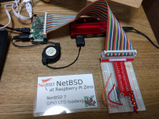
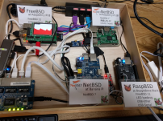
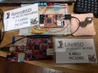
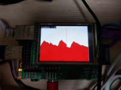
.. image:: images/RogueOne.png
.. image:: images/OSC2016KyotoMeshi.png

.. figure:: images/OSC2016KyotoNetwork.png
   :align: center

* LiteBSD at chipKIT Wi-FIRE 4.4BSD PIC32MZ
* RetroBSD at PIC32-RetroBSD 2.11BSD PIC32MX
* Gift box cluster 2

  * FreeBSD at Raspberry Pi B FreeBSD LCD loadavg via GPIO
  * NetBSD at Banana Pi
  * RaspBSD at BeagleBone Black FreeBSD11 LED loadavg, USB Ether+USB Serial via power port
  * NetBSD at Raspberry Pi 2B LanAP distcc 
  * NetBSD at Raspberry Pi Zero LED loadavg meter via GPIO

JNUG Seminar
-------------
* NetBSD Guide |Japanese|: http://www.soum.co.jp/~jun/OSC2016kyoto.pdf
* PSG sound at NetBSD/luna |Japanese|: https://speakerdeck.com/tsutsui/osc2016-kyoto-psg-tunes-on-netbsd-luna68k
* RetroBSD & LiteBSD by @610t |Japanese|: http://qml.610t.org/FreeBSD/OSC2016Kyoto_JNUG.html

OSC2015 Kansai@Kyoto
=====================
* Official Page |Japanese|: https://www.ospn.jp/osc2015-kyoto/
* 2016/8/7(Fri), 8(Sat) at Kyoto Research Park (KRP)
* K*BUG flyer |Japanese|: http://sacraya.610t.org/kbug/flyer/flyer-OSC2015Kyoto.pdf
* Report |Japanese|: http://qml.610t.org/FreeBSD/OSC2015Kyoto.html
* togetter by JNUG |Japanese|: https://togetter.com/li/857157
* netbsd-advocacy: "OpenBSD and NetBSD machines at Open Source Conference 2015 Kansai@Kyoto" http://mail-index.netbsd.org/netbsd-advocacy/2015/08/10/msg000691.html

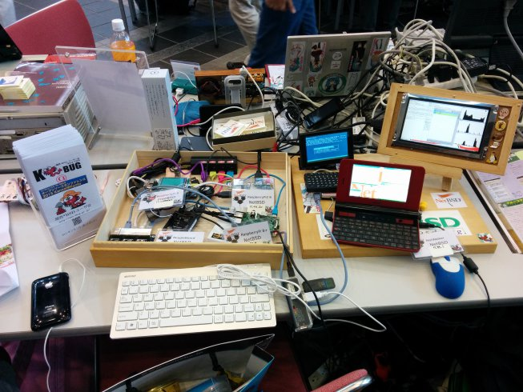

.. figure:: images/OSC2015KyotoNetwork.jpg
   :align: center

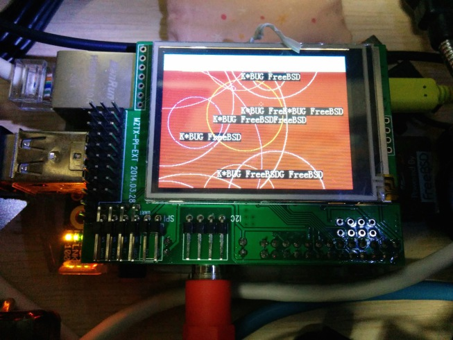
.. image:: images/distcc-rpi-mini.png
   :scale: 50%
.. image:: images/OSC2015KyotoGirl.png
.. image:: images/OSC2015KyotoMeshi.png

* Gift box cluster 1: distcc distributed compile cluster

  * NetBSD Raspberry Pi B+, 2B, Netwalker

* FreeBSD 11 MZTX-PI-EXT LCD via GPIO

JNUG Seminar
-------------
* NetBSD Guide |Japanese|: http://www.soum.co.jp/~jun/OSC2015kyoto.pdf
* Maintainance before 20 years machine at NetBSD |Japanese|: https://speakerdeck.com/tsutsui/osc2015kyoto-netbsd-and-old-machines

KOF 2014
=====================
* Official page |Japanese|: https://k-of.jp/2014/
* 2014/11/7(Fri), 8(Sat) at ATC (Osaka)
* K*BUG flyer |Japanese|: http://sacraya.610t.org/kbug/flyer/flyer-KOF2014.pdf
* togetter by JNUG |Japanese|: https://togetter.com/li/742243
* netbsd-advocacy: "NetBSD machines at KANSAI OPEN FORUM 2014" https://mail-index.netbsd.org/netbsd-advocacy/2014/11/08/msg000672.html

BSD BOF
-------------
* NetBSD Guide |Japanese|: http://www.soum.co.jp/~jun/KOF2014.pdf
* LUNA at KOF |Japanese|: https://speakerdeck.com/tsutsui/kof-and-luna-at-netbsd-booth

OSC2014 Kansai@Kyoto
=====================
* Official page |Japanese|: https://www.ospn.jp/osc2014-kyoto/
* 2014/8/1(Fri), 2(Sat) at Kyoto Research Park (KRP)
* togetter by JNUG |Japanese|: https://togetter.com/li/700617
* netbsd-advocacy: "NetBSD machines at Open Source Conference 2014 Kyoto" https://mail-index.netbsd.org/netbsd-advocacy/2014/08/09/msg000658.html

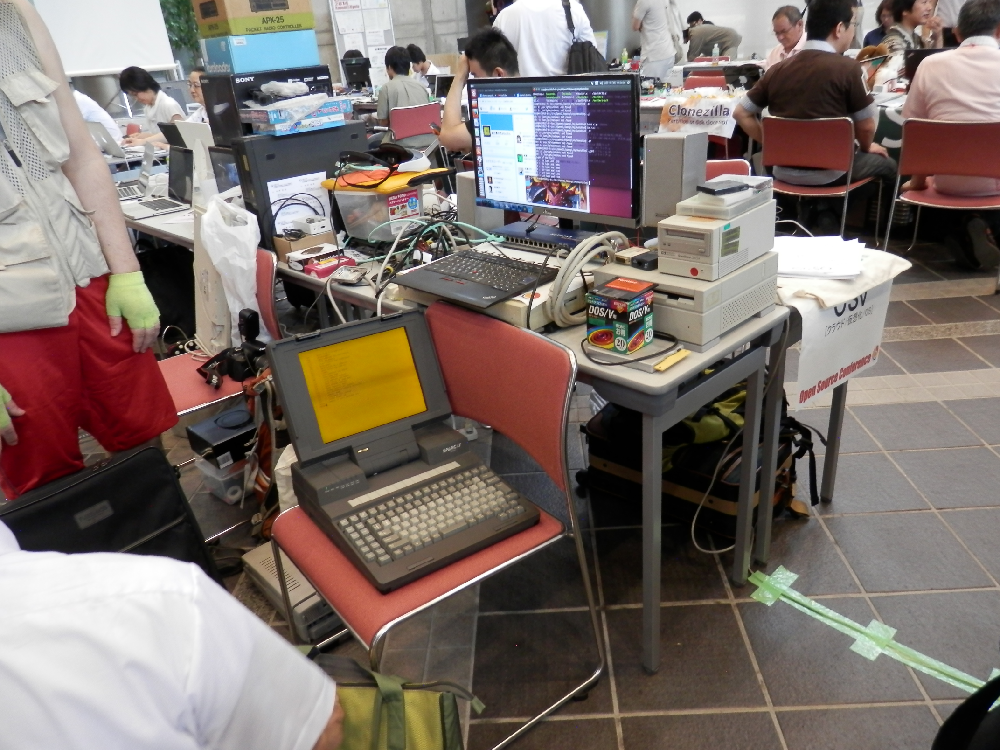
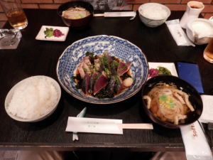
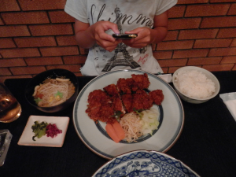

JNUG Seminar
-------------
* NetBSD Guide |Japanese|: http://www.soum.co.jp/~jun/OSC2014kyoto.pdf
* NetBSD/luna68k event of the past year |Japanese|: https://speakerdeck.com/tsutsui/osc2014-kansai-at-kyoto-netbsd-luna68k-report

OSC2013 Kansai@Kyoto
=====================
* Official page |Japanese|: https://www.ospn.jp/osc2013-kyoto/
* K*BUG flyer |Japanese|: http://sacraya.610t.org/kbug/flyer/flyer-OSC2013Kyoto.pdf
* Booth page |Japanese|: http://qml.610t.org/FreeBSD/OSC2013Kyoto.html
* Report |Japanese|: http://qml.610t.org/FreeBSD/OSC2013KyotoReport.html
* togetter by K*BUG |Japanese|: https://togetter.com/li/506220
* togetter by JNUG |Japanese|: https://togetter.com/li/542885

.. image:: images/OSC2013KyotoAudio.png
.. image:: images/OSC2013KyotoRetroBSD.png
.. image:: images/OSC2013KyotoBoard.png

.. image:: images/OSC2013KyotoMeshi1.png
.. image:: images/OSC2013KyotoMeshi2.png
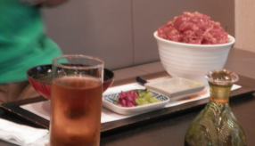
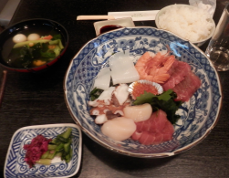

* iCat audio system
* RetroBSD, 2.11BSD on PIC32
* Board, board, board!!

  * Squeak Drive a Car with Gainer compatible board (Design Wave Magazine 2008/05: http://www.cqpub.co.jp/dwm/contents/dwm0126i.htm )
  * OpenGL controller with Coldfire board (Interface 2008/09: http://www.cqpub.co.jp/interface/contents/2008/JA/200809.htm )

JNUG Seminar
-------------
* NetBSD Guide |Japanese|: http://www.soum.co.jp/~jun/OSC2013kyoto.pdf
* all about OMRON LUNA, Do LUNA68K Dream of mltermic Twitter Sheep? |Japanese|: http://www.ceres.dti.ne.jp/tsutsui/osc2013kyoto/NetBSD-luna68k_mlterm-fb_Twitter.html
* Board, board, board!! |Japanese|: http://qml.610t.org/FreeBSD/OSC2013Kyoto610.html

Event @ Nara National College of Technology(NNCT) 13rd
========================================================
* Official page |Japanese|: http://qml.610t.org/NNCT/event13.html
* 2013/4/6(Sat) at NNCT

* [Hands on] FreeBSD on PC-BSD 9.1
* [Presentation] Let's enjoy BSD with boards |Japanese|: http://qml.610t.org/FreeBSD/furoku2013.html

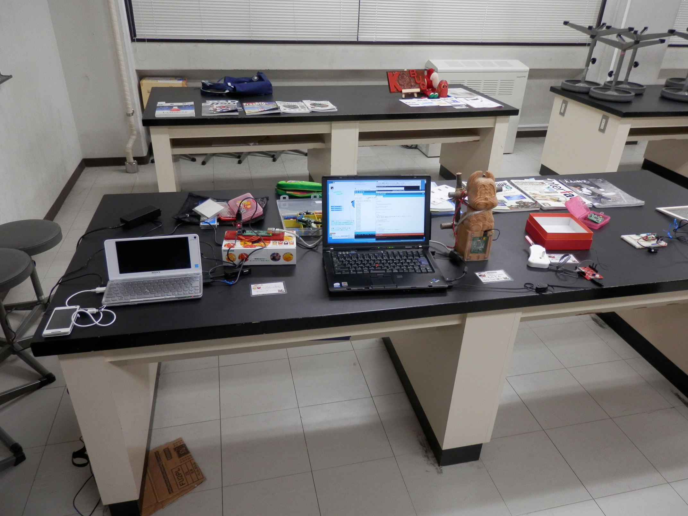

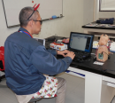
.. image:: images/Event@NNCT13-board.png
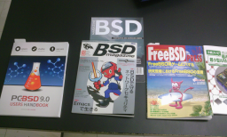
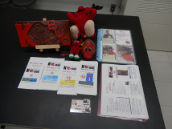
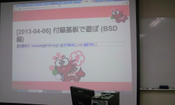
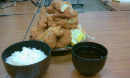

KOF 2012
=====================
* Official page |Japanese|: https://2012.k-of.jp/
* 2012/11/9(Fri), 10(Sat) at ATC (Osaka)

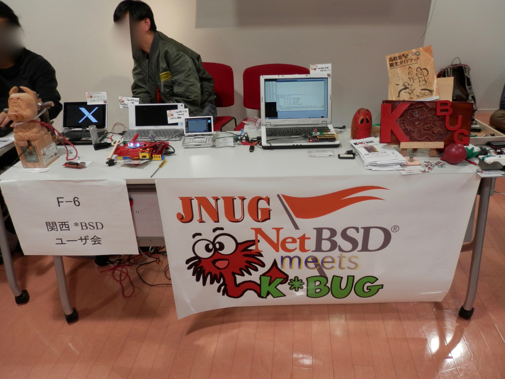

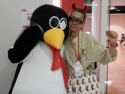
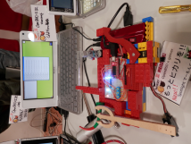
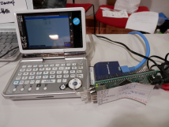
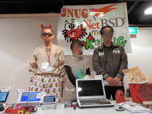
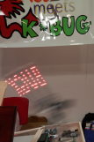

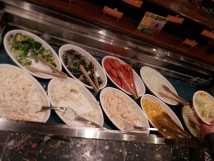
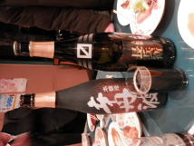
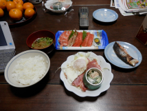
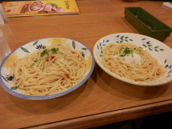

* More Lights!! Spotlight daemon  with OpenBSD/i386 x Gainer
* Squeak+Gainer Drive a Car!!
* Coldfire with 3 axis accelerometer board x OpenBSD/zaurus
* K*BUG POV using Arduino compatible board named Japanino http://otonanokagaku.net/japanino/

BSD BoF
-------------
* NetBSD Guide |Japanese|: http://www.soum.co.jp/~jun/KOF2012.pdf
* Recent BSD I/O |Japanese|: http://qml.610t.org/FreeBSD/BSD_IO_2012_presen.html
* (What is K*BUG? |Japanese|: http://qml.610t.org/FreeBSD/KBUG_KOF2012_presen.html )

OSC2012 Kansai@Kyoto
=====================
* Official page |Japanese|: https://www.ospn.jp/osc2012-kyoto/
* 2012/8/3(Fri), 4(Sat) at KRP
* togetter by JNUG |Japanese|: https://togetter.com/li/350035

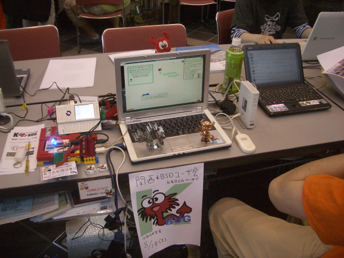

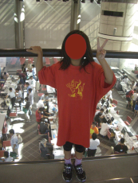
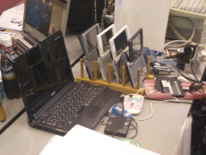
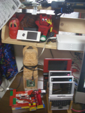

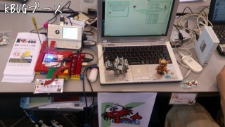
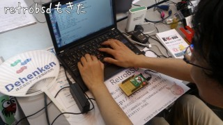
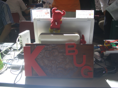

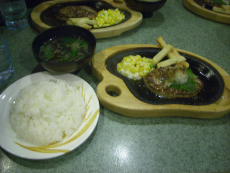

* RetroBSD, 2.11BSD on PIC32
* USL-5P
* High density zaurus rack.
* More Lights!! Spotlight daemon  with NetBSD/hpcmips (WS007SH) x Gainer

JNUG Seminar
-------------
* NetBSD Guide |Japanese|: http://www.soum.co.jp/~jun/OSC2012kyoto.pdf
* Recent NetBSD/luna68k |Japanese|: http://www.ceres.dti.ne.jp/tsutsui/osc2012kyoto/NetBSD-luna68k-updates.html
* Repair power unit of OMRON Luna-II |Japanese|: https://togetter.com/li/354562

Event @ NNCT 12nd
=================================================
* Official page |Japanese|: http://qml.610t.org/NNCT/event12.html
* 2012/7/29(Sun) at NNCT

* [Hands on] Install PC-BSD |Japanese| http://qml.610t.org/FreeBSD/PCBSD.html
* [Booth] Install BSD at various system
* [Presentation] Use BSD at work by BSD-BA |Japanese|: http://www.bsd-ba.org/

.. image:: images/Event@NNCT-all.png
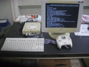
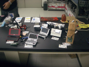
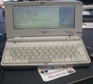
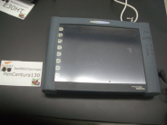
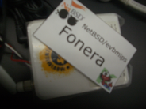
.. .. image:: images/Event@NNCT-Meshi.png

KOF 2011
=====================
* Official page |Japanese|: https://k-of.jp/2011/
* 2011/11/11(Fri), 12(Sat) at ATC
* togetter by JNUG |Japanese|: https://togetter.com/li/213724

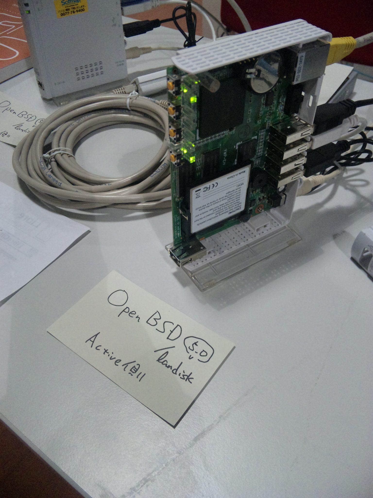
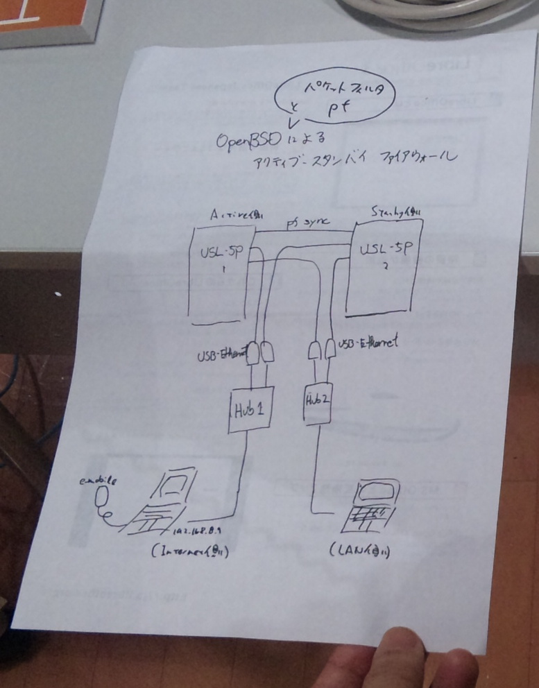
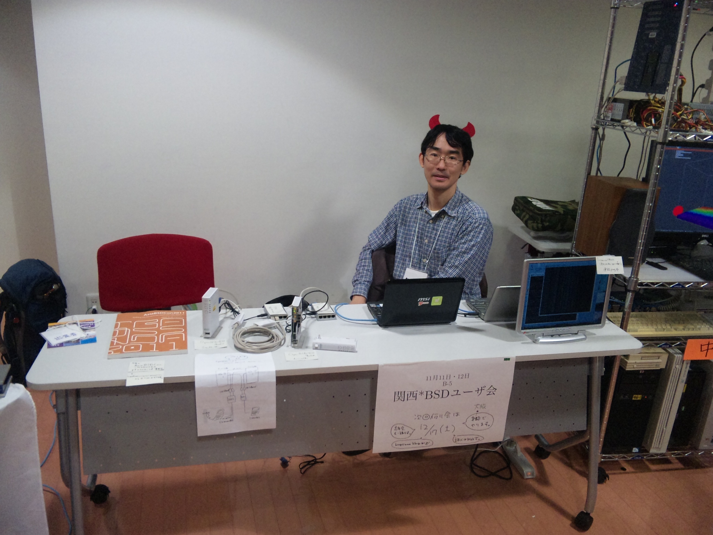

* Active/Standby Firewall with 2 OpenBSD/landisk at USL-5P |Japanese|: http://www.rururu.org/fswiki/wiki.cgi?page=OpenBSD%2Flandisk%A4%C7Active%2DStandby+Firewall
* {Net, Free, Open DragonFly}BSD at NetBSD/xen 

BSD BoF
-------------
* NetBSD Guide |Japanese|: http://www.soum.co.jp/~jun/KOF2011.pdf
* Why enigmatic machines? by @tsutsuii |Japanese|: http://www.ceres.dti.ne.jp/tsutsui/kof2011/Why-enigmatic-machines.html
* pkgsrc

OSC2011 Kansai@Kyoto
=====================
* Official page |Japanese|: https://www.ospn.jp/osc2011-kyoto/
* 2011/7/15(Fri), 16(Sat) at KRP
* K*BUG flyer |Japanese|: http://sacraya.610t.org/kbug/flyer/flyer-OSC2011Kyoto.pdf

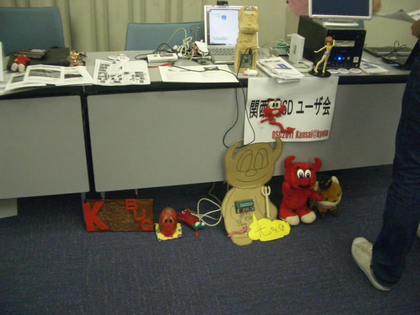

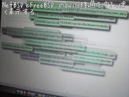
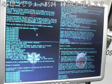
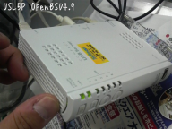
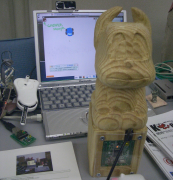

* OpenBSD/landisk USL-5P
* {Net, Free, Open, DragonFly}BSD at NetBSD/xen 
* Visualization NetBSD and FreeBSD build process.
* Squeak+Gainer Drive a Car!! with FreeBSD.
* More Light!! swing daemon based on Arduino.

JNUG Seminar
-------------
* NetBSD Guide |Japanese|: http://www.soum.co.jp/~jun/OSC2011kyoto.pdf
* "NetBSD/m68k will never die!" |Japanese|:  http://www.ceres.dti.ne.jp/tsutsui/osc2011kyoto/NetBSD-m68k-will-never-die.html

OSC2010 Kansai@Kyoto
=====================
* Official page |Japanese|: https://www.ospn.jp/osc2010-kyoto/
* 2010/7/9(Fri), 10(Sat) at kcg.edu: http://www.kcg.ac.jp/
* K*BUG flyer |Japanese|: http://sacraya.610t.org/kbug/flyer/flyer-OSC2010Kyoto.pdf

Booth
------
* Fastest script for installing FreeBSD.
* Try installation NetBSD/bebox, but fail...

OSC2010 Kansai@Kobe
=====================
* Official page |Japanese|: https://www.ospn.jp/osc2010-kobe/
* 2010/3/13(Sat) at Kobe Industrial Promotion Center
* K*BUG flyer |Japanese|: http://sacraya.610t.org/kbug/flyer/flyer-OSC2010Kobe.pdf

JNUG Seminar
-------------
* "making of SMC_TT - VME Ethernet using ISA NIC for ATARI TT030" by @tsutsuii |Japanese|: http://www.ceres.dti.ne.jp/tsutsui/osc2010kobe/SMC_TT-OSC2010Kobe.html
* Ethernet card SMC_TT for ATARI TT030 |Japanese|:https://togetter.com/li/76769

KOF 2009
=====================
* Official page |Japanese|: https://k-of.jp/2009/

* 2009/11/6(Fri), 7(Sat) at ATC
* K*BUG flyer |Japanese|: http://sacraya.610t.org/kbug/flyer/flyer-KOF2009.pdf

* NetBSD/mac68k on LC475Upgrade

OSC2009 Kansai@Kyoto
=====================
* Official page |Japanese|: https://www.ospn.jp/osc2009-kansai/
* 2009/7/10(Fri), 11(Sat) at kcg.edu: http://www.kcg.ac.jp/

Booth
------
* LED CPU meter
* BSD daemon statue gadgets
* USL-5P+USB LCD(landisk)

Nico-Tech: Kyoto Meeting (NK:M)
================================
* Official page |Japanese|: http://wiki.nicotech.jp/nico_tech/index.php?NTM2%2F%E9%96%A2%E8%A5%BF
* 2009/3/21(Sat) at Saiin-Kasuga shrine (Kyoto) http://www.kasuga.or.jp/
* Report |Japanese|: http://qml.610t.org/squeak/mutoh_20090321.html
* Presentation |Japanese|: http://www.nicovideo.jp/watch/sm6562064 (7:00-9:40)

* Squeak-ja meets K*BUG
* On FreeBSD

  * Squeak+Gainer Drive a Car!!
  * Scartch + PicoBoard
  * Servo motor daemon's tail  drive by USB audio device

* WorldStethoscope |Japanese|: http://swikis.ddo.jp/WorldStethoscope/6
* Squeak on Pocket Post Pet (Windows CE)

KOF 2008
=====================
* Official page |Japanese|: https://k-of.jp/2008/
* 2008/11/7(Fri), 8(Sat) at ATC (Osaka)
* K*BUG flyer |Japanese|: http://sacraya.610t.org/kbug/flyer/flyer-KOF2008.pdf

* OpenBSD/landisk at USL-5P
* Devices: Servo motor deive deamon's tails using USB audio, Squeak+Gainer http://www.yengawa.com/squeak_gainer

OSC2008 Kansai@Kyoto
=====================
* Official page |Japanese|: https://www.ospn.jp/osc2008-kansai/
* 2008/7/18(Fri), 19(Sat) at kcg.edu: http://www.kcg.ac.jp/

.. image:: images/OSC2008KyotoAlpha.png

.. .. image:: images/OSC2008KyotoMeshi1.png

* BSD for various machines: sgi O2, BeBox(not work), Zaurus, ML115, Fonera, NetBSD/hpcmips, hpcsh, evbmips, alpha (digital Alpha Multia)
* Miku Hatsune paper doll with Six servo moters controlled by USB audio
* Devices: USB one-seg tuner, UHID based themal sensor USB-RH https://strawberry-linux.com/catalog/items?code=52002

KOF 2007
===========
* Official page |Japanese|: https://k-of.jp/2007/
* 2007/11/9(Fri), 10(Sat) at ATC

.. image:: images/KOF2007Board.png
   :scale: 9%

Event @ NNCT 11st
=================================================
* Official page |Japanese|: http://qml.610t.org/NNCT/event13.html
* 2007/3/31(Sat) at NNCT
* Report |Japanese|: http://qml.610t.org/NNCT/report_event_11th.html

.. .. image:: images/Event@NNCT11-WiFi.png

* Introduction NNCT Information Engineering Computer Room.
* FreeBSD ports: RoboCup 2D simulator
* Create Squeak Dual Boot CDROM |Japanese|: http://qml.610t.org/squeak/squeak_cdrom.html

KOF 2006
===========
* Official page |Japanese|: https://k-of.jp/2006/
* 2006/11/17(Fri), 18(Sat) at ATC

* On FreeBSD

  * Croquet: https://en.wikipedia.org/wiki/Croquet_Project
  * Squeak + WorldStethoscope
  * Moeru Squeak ( http://moesuku.ofg.jp/ |Japanese|) on ONScripter ( https://onscripter.osdn.jp/onscripter.html |Japanese|) 

Event @ NNCT 3rd
=================================================
* 2002/7/20(Sat) at NNCT
* Report |Japanese| published at FreeBSD Press No12: http://sacraya.610t.org/Press/No12/nnct-event/

Presentations
---------------------------------------
* Report: xcast6 online meeting
* Postfix
* One chip microcomputer AVR
* Recovery 48 computers using PXEBOOT in 30 minutes
* Document using SmartDoc
* About DocBook/SGML

Event @ NNCT 1st
=================================================
* 2001/8/4(Sat) at NNCT
* Report |Japanese| published at FreeBSD Press No7: http://sacraya.610t.org/Press/No7/bugs/

* BSD for various machines.

  * NetBSD/hpcmips: NEC MobileGearII 330R, Fujitsu PenCentura130, PocketPostpet 
  * NetBSD/sun3: Sun 3/60
  * NetBSD/sun3x: Sun 3/80
  * NetBSD/mac68k: Macintosh IIcx
  * NetBSD/news68k: Sony NEWS NWS-831,PWS-1550,NWS-1720

* Install hands on
* BSD media in Japan

.. contents:: Table of Contents
   :depth: 1

* Print version PDF is at http://sacraya.610t.org/kbug/book/booth/KBUGBoothGuide-print.pdf
* Valid link PDF is at http://sacraya.610t.org/kbug/book/booth/KBUGBoothGuide.pdf
* HTML version is at http://sacraya.610t.org/kbug/book/booth/singlehtml/
* Source is at https://github.com/610t/kbug/tree/master/book/booth/

.. csv-table::
   :align: right

   2017/2/25,	Photobook edition
..   "2017/3/11", "AsiaBSDCon 2017 edition"

