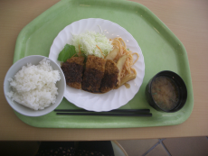
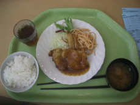
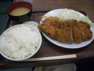
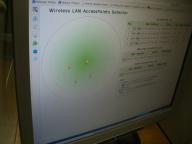

.. K*BUG Booth Guide documentation master file, created by
   sphinx-quickstart on Sat Feb 11 09:29:46 2017.
   You can adapt this file completely to your liking, but it should at least
   contain the root `toctree` directive.

.. sectnum::

.. |Japanese| image:: images/Japan-flag.png 

What is Kansai * BSD Users Group?
==========================================
Kansai * BSD Users Group (K*BUG) is regional BSD Users Group at Kansai area in Japan.
Kansai area has many cities including Osaka, Kyoto, Kobe, Nara and so on.

.. Policy
.. --------

Deamon-Mushi
-------------
Deamon-Mushi is a mascot character for K*BUG.

.. figure:: images/KBUGseal2.jpg
   :align: center

Meeting
--------
We hold meeting every 2 monthes.

We use these meeting rooms:

* AXE Inc. meeting room at Kyoto: http://www.axe-inc.co.jp/english/index.html
* Grand front Osaka: https://www.grandfront-osaka.jp/multilingulal/

Event activities
------------------
We open booth at these events:

* Open Source Conference |Japanese|: http://ospn.jp/
* Kansai Open Forum |Japanese|: https://k-of.jp/

AsiaBSDCon 2017
==========================================
* Official page: https://2017.asiabsdcon.org/
.. * twitter: #abc

Kansai * BSD Users Group 2017/2/11 meeting
==========================================
* Official page |Japanese| : http://www.kbug.gr.jp/events/2017-1st.html
* 2017/2/11(Sat) at Axe inc (Kyoto)
* Facebook |Japanese|: https://www.facebook.com/events/920179428083721/
* togetter |Japanese|: https://togetter.com/li/1078967

.. figure:: images/Booth.png
   :align: center

.. image:: images/RetroBSD.png
.. image:: images/LiteBSD.png
.. image:: images/RaspberryPiZero.png

* RetroBSD: 2.11BSD on MIPS(PIC32MX). The board name is Pinguino-RetroBSD.
* LiteBSD: 4.4BSDLite on MIPS(PIC32MZ). The board name is Chipkit WiFire. Serial Console is Pocket C.H.I.P.
* Raspberry Pi Zero

Presentations
---------------------------------------
* IOzone graph with Excel
* K*BUG @ OSC2015 |Japanese|: http://qml.610t.org/FreeBSD/OSC2015Kyoto.html
* Raspberry Pi 3 on FreeBSD
* Scratch on BSD |Japanese|: http://qml.610t.org/FreeBSD/ScratchBSD.html
* iOS with wired LAN

Open Source Conference (OSC) 2017 Osaka
=========================================
* Official page |Japanese|: https://www.ospn.jp/osc2017-osaka/
* 2017/1/27(Fri), 28(Sat) at Osaka Sansokan
* K*BUG flyer (not published) |Japanese|: http://sacraya.610t.org/kbug/flyer/flyer-OSC2017Osaka.pdf
* togetter by JNUG |Japanese|: https://togetter.com/li/1075115

JNUG Seminar
-------------
* NetBSD Guide |Japanese|: http://www.soum.co.jp/~jun/OSC2017osaka.pdf
* NetBSD+pkgsrc PC-6001 emulator |Japanese|: https://speakerdeck.com/tsutsui/osc2017-osaka-pc-6001-emulator-on-netbsd-and-pkgsrc

KOF 2016
=====================
* Official page |Japanese|: https://2016.k-of.jp/
* 2016/11/(Fri), (Sat) at ATC (Osaka)
* togetter by JNUG |Japanese|: https://togetter.com/li/1047263

Open Source Conference (OSC) 2016 Kyoto
=========================================
* Official page |Japanese|: https://www.ospn.jp/osc2016-kyoto/
* 2016/7/29(Fri), 30(Sat) at Kyoto Research Park (KRP)
* K*BUG flyer |Japanese|: http://sacraya.610t.org/kbug/flyer/flyer-OSC2016Kyoto.pdf
* Report |Japanese|: http://qml.610t.org/FreeBSD/OSC2016Kyoto.html
* togetter by JNUG |Japanese|: https://togetter.com/li/1005828
* netbsd-advocacy "NetBSD machines at Open Source Conference 2016 Kyoto": http://mail-index.netbsd.org/netbsd-advocacy/2016/08/01/msg000712.html

.. figure:: images/OSC2016KyotoBooth.png
   :align: center

.. image:: images/OSC2016KyotoPiZero.png
.. image:: images/OSC2016KyotoBox.png
.. image:: images/OSC2016KyotoRetroLiteBSD.png
.. image:: images/OSC2016KyotoGPIO.png
.. image:: images/RogueOne.png
.. image:: images/OSC2016KyotoMeshi.png

.. figure:: images/OSC2016KyotoNetwork.png
   :align: center

JNUG Seminar
-------------
* NetBSD Guide |Japanese|: http://www.soum.co.jp/~jun/OSC2016kyoto.pdf
* PSG sound at NetBSD/luna |Japanese|: https://speakerdeck.com/tsutsui/osc2016-kyoto-psg-tunes-on-netbsd-luna68k
* RetroBSD & LiteBSD |Japanese|: http://qml.610t.org/FreeBSD/OSC2016Kyoto_JNUG.html

OSC2015 Kansai@Kyoto
=====================
* Official Page |Japanese|: https://www.ospn.jp/osc2015-kyoto/
* 2016/8/7(Fri), 8(Sat) at Kyoto Research Park (KRP)
* K*BUG flyer |Japanese|: http://sacraya.610t.org/kbug/flyer/flyer-OSC2015Kyoto.pdf
* Report |Japanese|: http://qml.610t.org/FreeBSD/OSC2015Kyoto.html
* togetter by JNUG |Japanese|: https://togetter.com/li/857157

.. figure:: images/OSC2015KyotoBooth.png
   :align: center

.. figure:: images/OSC2015KyotoNetwork.jpg
   :align: center

.. image:: images/OSC2015KyotoGirl.png
.. image:: images/OSC2015KyotoMeshi.png

JNUG Seminar
-------------
* NetBSD Guide |Japanese|: http://www.soum.co.jp/~jun/OSC2015kyoto.pdf
* Maintainance 20 years before machine at NetBSD: https://speakerdeck.com/tsutsui/osc2015kyoto-netbsd-and-old-machines

KOF 2014
=====================
* Official page |Japanese|: https://2016.k-of.jp/
* 2014/11/7(Fri), 8(Sat) at ATC (Osaka)
* K*BUG flyer |Japanese|: http://sacraya.610t.org/kbug/flyer/flyer-KOF2014.pdf
* togetter by JNUG |Japanese|: https://togetter.com/li/742243

JNUG Seminar
-------------
* NetBSD Guide |Japanese|: http://www.soum.co.jp/~jun/KOF2014.pdf
* LUNA at KOF |Japanese|: https://speakerdeck.com/tsutsui/kof-and-luna-at-netbsd-booth

OSC2014 Kansai@Kyoto
=====================
* Official page |Japanese|: https://www.ospn.jp/osc2014-kyoto/
* 2016/8/7(Fri), 8(Sat) at Kyoto Research Park (KRP)
* togetter by JNUG |Japanese|: https://togetter.com/li/857157

.. image:: images/OSC2014KyotoMeshi1.png
.. image:: images/OSC2014KyotoMeshi2.png

OSC2013 Kansai@Kyoto
=====================
* Official page |Japanese|: https://www.ospn.jp/osc2013-kyoto/
* K*BUG flyer |Japanese|: http://sacraya.610t.org/kbug/flyer/flyer-OSC2013Kyoto.pdf
* Booth page |Japanese|: http://qml.610t.org/FreeBSD/OSC2013Kyoto.html
* Report |Japanese|: http://qml.610t.org/FreeBSD/OSC2013KyotoReport.html
* Board, board, board!! |Japanese| at JNUG seminar: http://qml.610t.org/FreeBSD/OSC2013Kyoto610.html
* togetter by JNUG |Japanese|: https://togetter.com/li/506220

.. image:: images/OSC2013KyotoAudio.png
.. image:: images/OSC2013KyotoRetroBSD.png
.. image:: images/OSC2013KyotoBoard.png

.. image:: images/OSC2013KyotoMeshi1.png
.. image:: images/OSC2013KyotoMeshi2.png
.. image:: images/OSC2013KyotoMeshi3.png
.. image:: images/OSC2013KyotoMeshi4.png

Event @ Nara National College of Technology(NNCT) 13rd
========================================================
* Official page |Japanese|: http://qml.610t.org/NNCT/event13.html
* 2013/4/6(Sat) at NNCT

* [Hands on] FreeBSD on PC-BSD 9.1
* [Presentation] Let's enjoy BSD with boards |Japanese|: http://qml.610t.org/FreeBSD/furoku2013.html

.. image:: images/Event@NNCT13-mutoh.png
.. image:: images/Event@NNCT13-board.png
.. image:: images/Event@NNCT13-book.png
.. image:: images/Event@NNCT13-flyer.png
.. image:: images/Event@NNCT13-presen.png
.. image:: images/Event@NNCT13-tonmasa.png

KOF 2012
=====================
* Official page |Japanese|: https://2012.k-of.jp/
* 2012/11/9(Fri), 10(Sat) at ATC (Osaka)

.. figure:: images/KOF2012Booth.png
   :alt: center

.. image:: images/KOF2012Penguin.png
.. image:: images/KOF2012Arduino.png
.. image:: images/KOF2012Zaurus.png
.. image:: images/KOF2012Family.png
.. image:: images/KOF2012POV.png

.. image:: images/KOF2012Meshi1.png
.. image:: images/KOF2012Meshi2.png
.. image:: images/KOF2012Meshi3.png
.. image:: images/KOF2012Meshi4.png

OSC2012 Kansai@Kyoto
=====================
* Official page |Japanese|: https://www.ospn.jp/osc2012-kyoto/
* togetter by JNUG |Japanese|: https://togetter.com/li/350035

.. figure:: images/OSC2012KyotoBooth.png
   :align: center

.. image:: images/OSC2012KyotoBoothView.png
.. image:: images/OSC2012KyotoZaurus.png
.. image:: images/OSC2012KyotoMyRoom.png

.. image:: images/OSC2012KyotoKBUG.jpg
.. image:: images/OSC2012KyotoRetroBSD.jpg
.. image:: images/OSC2012KyotoBoothBack.png

.. image:: images/OSC2012KyotoMeshi3.png

Event @ NNCT 12nd
=================================================
* Official page |Japanese|: http://qml.610t.org/NNCT/event12.html

* [Hands on] Install PC-BSD |Japanese| http://qml.610t.org/FreeBSD/PCBSD.html
* [Booth] Install BSD at various system
* [Presentation] Use BSD at work by BSD-BA |Japanese|: http://www.bsd-ba.org/

.. image:: images/Event@NNCT-all.png
.. image:: images/Event@NNCT-dreamcast.png
.. image:: images/Event@NNCT-sharp.png
.. image:: images/Event@NNCT-MobileGear.png
.. image:: images/Event@NNCT-PenCentra.png
.. image:: images/Event@NNCT-Fonera.png
.. .. image:: images/Event@NNCT-Meshi.png

OSC2011 Kansai@Kyoto
=====================
* Official page |Japanese|: https://www.ospn.jp/osc2011-kyoto/
* K*BUG flyer |Japanese|: http://sacraya.610t.org/kbug/flyer/flyer-OSC2011Kyoto.pdf
* togetter by JNUG |Japanese|: 

.. figure:: images/OSC2011KyotoBooth.png
   :align: center

.. image:: images/OSC2011KyotoBuild.png
.. image:: images/OSC2011KyotoVM.png
.. image:: images/OSC2011KyotoOpenBSD.png
.. image:: images/OSC2011KyotoJoyStick.png
.. image:: images/OSC2011KyotoGion1.png

OSC2010 Kansai@Kyoto
=====================
* Official page |Japanese|: https://www.ospn.jp/osc2010-kyoto/
* K*BUG flyer |Japanese|: http://sacraya.610t.org/kbug/flyer/flyer-OSC2010Kyoto.pdf

OSC2010 Kansai@Kobe
=====================
* Official page |Japanese|: https://www.ospn.jp/osc2010-kobe/
* K*BUG flyer |Japanese|: http://sacraya.610t.org/kbug/flyer/flyer-OSC2010Kobe.pdf

KOF 2009
=====================
* Official page |Japanese|: https://k-of.jp/2009/
* 2009/11/6(Fri), 7(Sat) at ATC
* K*BUG flyer |Japanese|: http://sacraya.610t.org/kbug/flyer/flyer-KOF2009.pdf

.. figure:: images/KOF2009Booth.png
   :align: center

OSC2009 Kansai@Kyoto
=====================
* Official page |Japanese|: https://www.ospn.jp/osc2009-kansai/
* 2008/7/18(Fri), 19(Sat) at kcg.edu: http://www.kcg.ac.jp/
.. * togetter by JNUG |Japanese|: 

KOF 2008
=====================
* Official page |Japanese|: https://k-of.jp/2008/
* 2008/11/7(Fri), 8(Sat) at ATC (Osaka)
* K*BUG flyer |Japanese|: http://sacraya.610t.org/kbug/flyer/flyer-KOF2008.pdf

.. figure:: images/KOF2008Booth.png
   :align: center

.. image:: images/KOF2008daemon.png
.. image:: images/KOF2008USL-5P.png
.. image:: images/KOF2008Meshi1.png
.. image:: images/KOF2008Meshi2.png
.. image:: images/KOF2008Yakei.png

OSC2008 Kansai@Kyoto
=====================
* Official page |Japanese|: https://www.ospn.jp/osc2008-kansai/
* 2008/7/18(Fri), 19(Sat) at kcg.edu: http://www.kcg.ac.jp/
.. * K*BUG flyer |Japanese|: 

.. figure:: images/OSC2008KyotoBooth.png
   :align: center

.. image:: images/OSC2008KyotoIshihara.png
.. image:: images/OSC2008KyotoBag.png
.. image:: images/OSC2008KyotoAlpha.png
.. image:: images/OSC2008KyotoMiku.png
.. image:: images/OSC2008KyotoMutoh.png
.. image:: images/OSC2008KyotoMen.png
.. image:: images/OSC2008KyotoFlyer.png

.. image:: images/OSC2008KyotoKonomi.png
.. image:: images/OSC2008KyotoYakiRamen.png
.. image:: images/OSC2008KyotoCheese.png

Event @ NNCT 11st
=================================================
* Official page |Japanese|: http://qml.610t.org/NNCT/event13.html
* 2017/3/31(Sat) at NNCT

* Introduction NNCT Information Engineering Computer Room.
* FreeBSD ports: RoboCup 2D simulator
* Create Squeak Dual Boot CDROM |Japanese|: http://qml.610t.org/squeak/squeak_cdrom.html

.. image:: images/Event@NNCT11-OLPC.png
.. image:: images/Event@NNCT11-GRUB.png

.. image:: images/Event@NNCT11-RoboCup.png
.. image:: images/Event@NNCT11-cherry.png
.. image:: images/Event@NNCT11-meshi1.png
.. image:: images/Event@NNCT11-meshi2.png

Event @ NNCT 3rd
=================================================
* 2002/7/20(Sat) at NNCT
* Report |Japanese| published at FreeBSD Press No12: http://sacraya.610t.org/Press/No12/nnct-event/

Presentations
---------------------------------------
* Report: xcast6 online meeting
* Postfix
* One chip microcomputer AVR
* Recovery 48 computers using PXEBOOT in 30 minutes
* Document using SmartDoc
* About DocBook/SGML

Event @ NNCT 1st
=================================================
* 2001/8/4(Sat) at NNCT
* Report |Japanese| published at FreeBSD Press No7: http://sacraya.610t.org/Press/No7/bugs/

Presentations
---------------------------------------
* BSD for various machines.

  * NetBSD/hpcmips: NEC MobileGearII 330R, Fujitsu PenCentura130, PocketPostpet 
  * NetBSD/sun3: Sun 3/60
  * NetBSD/sun3x: Sun 3/80
  * NetBSD/mac68k: Macintosh IIcx
  * NetBSD/news68k: Sony NEWS NWS-831,PWS-1550,NWS-1720

* Install hands on
* BSD media in Japan

.. image:: images/Event@NNCT1-media.png
.. image:: images/Event@NNCT1-working.png
.. image:: images/Event@NNCT1-poster.png
.. image:: images/Event@NNCT1-machines.jpg

.. csv-table::

   "2017/2/25", "Photobook edition"
   "2017/3/11", "AsiaBSDCon 2017 edition"

