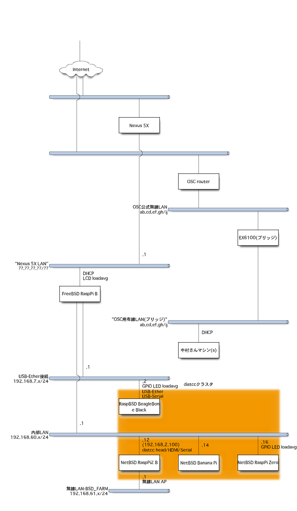
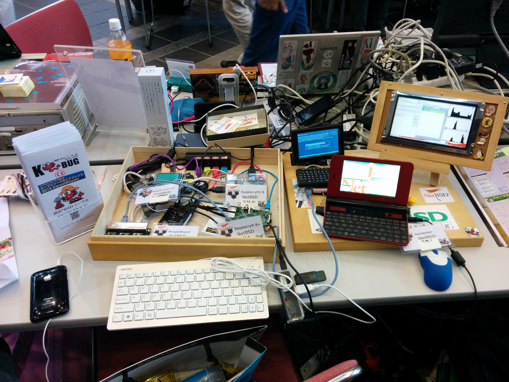
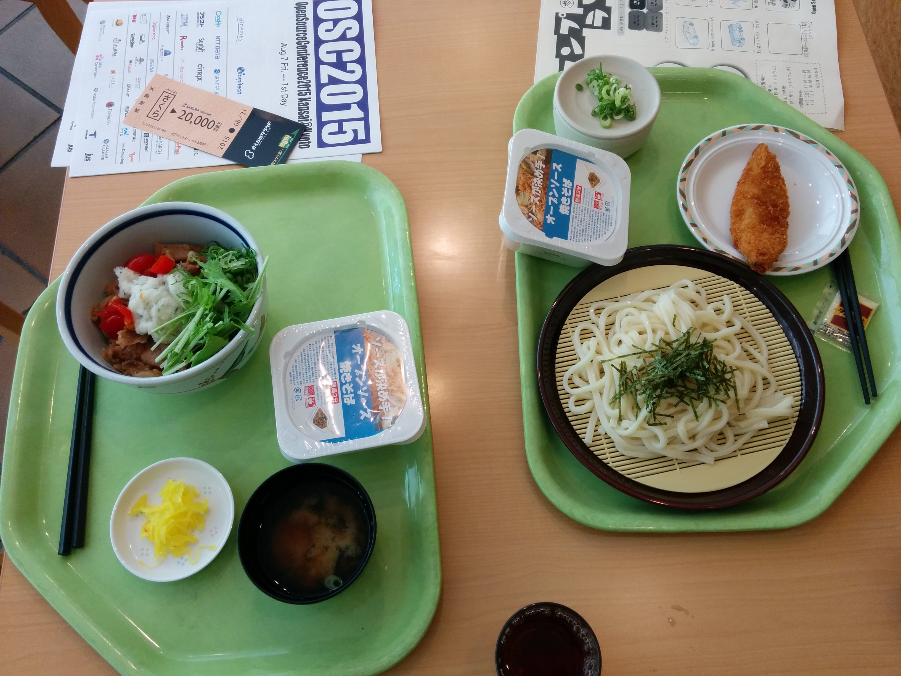

.. K*BUG Booth Guide documentation master file, created by
   sphinx-quickstart on Sat Feb 11 09:29:46 2017.
   You can adapt this file completely to your liking, but it should at least
   contain the root `toctree` directive.

関西*BSDユーザ会(K*BUG) イベント出展ガイド
=============================================

* http://www.kbug.gr.jp/

.. toctree::
   :maxdepth: 2
   :caption: Contents:

OSC2016 Kyoto
=====================
* 公式ページ: https://www.ospn.jp/osc2016-kyoto/
* チラシ: http://sacraya.610t.org/kbug/flyer/flyer-OSC2016Kyoto.pdf
* 報告: http://qml.610t.org/FreeBSD/OSC2016Kyoto.html

   OSC2016 Kyotoブース展示

   Rogue One: rogueをひとりでする

   OSC2016 Kyotoのネットワーク構成図

OSC2015 Kansai@Kyoto
=====================
* 公式ページ: https://www.ospn.jp/osc2015-kyoto/
* 報告: http://qml.610t.org/FreeBSD/OSC2015Kyoto.html

   OSC2015 Kansai@Kyotoブース展示

.. figure:: images/OSC2015KyotoGirl.jpg

   看蛮むすめ、手芸をする。

.. figure:: images/OSC2015KyotoNetwork.jpg

   OSC2015 Kansai@Kyotoのネットワーク構成図

   隣のカフェテリアのメシ

OSC2013 Kansai@Kyoto
=====================
* 公式ページ: https://www.ospn.jp/osc2013-kyoto/
* 特設ページ: http://qml.610t.org/FreeBSD/OSC2013Kyoto.html
* 報告: http://qml.610t.org/FreeBSD/OSC2013KyotoReport.html
.. figure:: images/OSC2013KyotoAudio.png

   OSC2013 Kansai@ブース展示:前川さんの展示

.. figure:: images/OSC2013KyotoRetroBSD.png

   OSC2013 Kansai@ブース展示: RetroBSD

.. figure:: images/OSC2013KyotoBoard.png

   OSC2013 Kansai@Kyotoブース展示:基板の気分

.. figure:: images/OSC2013KyotoMeshi1.png

   隣のカフェテリアの定食

.. figure:: images/OSC2013KyotoMeshi2.png

   だいこんの花のチキンカツ
