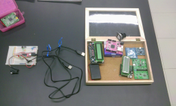
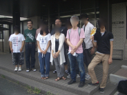
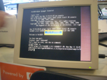

.. K*BUG Booth Guide documentation master file, created by
   sphinx-quickstart on Sat Feb 11 09:29:46 2017.
   You can adapt this file completely to your liking, but it should at least
   contain the root `toctree` directive.

Kansai * BSD Users Group Event Guide
=============================================

AsiaBSDCon 2017 https://2017.asiabsdcon.org/ Edition

.. figure:: images/Booth.png
   :align: center

   http://www.kbug.gr.jp/

.. image:: images/QRcodePDF.png
.. image:: images/QRcodeWWW.png
.. image:: images/QRcodeFacebook.png

AsiaBSDCon 2017
==========================================
* Official page: https://2017.asiabsdcon.org/
* twitter: #abc

Kansai * BSD Users Group 2017/2/11 meeting
==========================================
* Official page: http://www.kbug.gr.jp/events/2017-1st.html
* 2017/2/11(Sat) at Axe inc (Kyoto)
* Facebook: https://www.facebook.com/events/920179428083721/
* togetter summary: https://togetter.com/li/1078967

.. figure:: images/Booth.png
   :align: center

.. image:: images/RetroBSD-1.png
.. image:: images/LiteBSD-1.png

* RetroBSD: 2.11BSD on MIPS(PIC32MX). The board name is Pinguino-RetroBSD.
* LiteBSD: 4.4BSDLite on MIPS(PIC32MZ). The board name is Chipkit WiFi
* Raspberry Pi Zero

Presentations
---------------------------------------
* IOzone graph with Excel
* K*BUG @ OSC2015 (in Japanse): http://qml.610t.org/FreeBSD/OSC2015Kyoto.html
* Raspberry Pi on FreeBSD
* Scratch on BSD (in Japanse): http://qml.610t.org/FreeBSD/ScratchBSD.html
* iOS with wired LAN

OSC2016 Kyoto
=====================
* Official page: https://www.ospn.jp/osc2016-kyoto/
* 2016/7/29(Fri), 30(Sat) at Kyoto Research Park (KRP)
* Flyer: http://sacraya.610t.org/kbug/flyer/flyer-OSC2016Kyoto.pdf
* Report(in Japanese): http://qml.610t.org/FreeBSD/OSC2016Kyoto.html

.. figure:: images/OSC2016KyotoBooth-1.png
   :align: center

.. image:: images/RogueOne.png

.. figure:: images/OSC2016KyotoNetwork-1.png
   :align: center

Japan NetBSD Users Group (JNUG) at OSC2016 Kyoto
------------------------------------------
* Official Page: http://www.jp.netbsd.org/
* togetter: https://togetter.com/li/1005828
* netbsd-advocacy "NetBSD machines at Open Source Conference 2016 Kyoto": http://mail-index.netbsd.org/netbsd-advocacy/2016/08/01/msg000712.html

.. figure:: images/OSC2016KyotoJNUG.jpg
   :align: center

OSC2015 Kansai@Kyoto
=====================
* Official Page: https://www.ospn.jp/osc2015-kyoto/
* Report (in Japanese): http://qml.610t.org/FreeBSD/OSC2015Kyoto.html
.. figure:: images/OSC2015KyotoBooth.png
   :align: center

.. figure:: images/OSC2015KyotoNetwork.jpg
   :align: center

.. image:: images/OSC2015KyotoGirl.png
.. image:: images/OSC2015KyotoMeshi.png

JNUG at OSC2015 Kyoto
------------------------------------------
* Official Page: http://www.jp.netbsd.org/
* togetter: https://togetter.com/li/857157
* netbsd-advocacy "": 

.. figure:: images/OSC2015KyotoJNUG.jpg
   :align: center

OSC2014 Kansai@Kyoto
=====================
* Official page: https://www.ospn.jp/osc2014-kyoto/

.. image:: images/OSC2014KyotoMeshi1.png

.. image:: images/OSC2014Kyoto.png
.. image:: images/OSC2014Kyoto.png
.. image:: images/OSC2014Kyoto.png

OSC2013 Kansai@Kyoto
=====================
* Official page: https://www.ospn.jp/osc2013-kyoto/
* Booth page (in Japanese): http://qml.610t.org/FreeBSD/OSC2013Kyoto.html
* Report (in Japanese): http://qml.610t.org/FreeBSD/OSC2013KyotoReport.html
* togetter report (in Japanese): https://togetter.com/li/506220

.. image:: images/OSC2013KyotoAudio.png
.. image:: images/OSC2013KyotoRetroBSD.png
.. image:: images/OSC2013KyotoBoard.png

Japan NetBSD Users Group at OSC2013 Kyoto
------------------------------------------
* Official Page: http://www.jp.netbsd.org/
* netbsd-advocacy "": 

.. image:: images/OSC2013KyotoMeshi1.png
.. image:: images/OSC2013KyotoMeshi2.png
.. image:: images/OSC2013KyotoMeshi3.png
.. image:: images/OSC2013KyotoMeshi4.png

Event @ Nara National College of Technology(NNCT) 13rd
=================================================
* Official page: http://qml.610t.org/NNCT/event13.html
* 2013/4/6(Sat) at NNCT

.. image:: images/Event@NNCT13-book.png
.. image:: images/Event@NNCT13-flyer.png
.. image:: images/Event@NNCT13-presen.png
.. image:: images/Event@NNCT13-tonmasa.png

- [Hands on] FreeBSD on PC-BSD 9.1
- [Presentation] Let's enjoy BSD with boards (in Japanese): http://qml.610t.org/FreeBSD/furoku2013.html

KOF 2012
=====================
* Official page: https://2012.k-of.jp/
* 2012/11/9(Fri), 10(Sat) at ATC (Osaka)

.. image:: images/KOF2012Penguin.png
.. image:: images/KOF2012Arduino.png
.. image:: images/KOF2012Zaurus.png
.. image:: images/KOF2012Family.png
.. image:: images/KOF2012POV.png

.. image:: images/KOF2012Meshi1.png
.. image:: images/KOF2012Meshi2.png
.. image:: images/KOF2012Meshi3.png

OSC2012 Kansai@Kyoto
=====================
* Official page: https://www.ospn.jp/osc2012-kyoto/
* JNUG togetter report (in Japanese): https://togetter.com/li/350035

.. figure:: images/OSC2012KyotoBooth.png
   :align: center

.. image:: images/OSC2012KyotoBoothView.png
.. image:: images/OSC2012KyotoZaurus.png
.. image:: images/OSC2012KyotoMyRoom.png

.. image:: images/OSC2012KyotoKBUG.jpg
.. image:: images/OSC2012KyotoRetroBSD.jpg
.. image:: images/OSC2012KyotoBoothBack.png

.. image:: images/OSC2012KyotoMeshi1.png
.. image:: images/OSC2012KyotoMeshi2.png
.. image:: images/OSC2012KyotoMeshi3.png

Event @ NNCT 12nd
=================================================
* Official page: http://qml.610t.org/NNCT/event12.html

.. image:: images/Event@NNCT-sharp.png

.. image:: images/Event@NNCT-PenCentra.png
.. image:: images/Event@NNCT-Fonera.png
.. .. image:: images/Event@NNCT-Meshi.png

* [Hands on] Install PC-BSD (in Japanese) http://qml.610t.org/FreeBSD/PCBSD.html
* [Booth] Install BSD at various system
* [Presentation] Use BSD at work by BSD-BA http://www.bsd-ba.org/

OSC2011 Kansai@Kyoto
=====================
* Official page: https://www.ospn.jp/osc2011-kyoto/
* JNUG togetter report (in Japanese): 

.. figure:: images/OSC2011KyotoBooth.png
   :align: center

.. image:: images/OSC2011KyotoBuild.png

.. image:: images/OSC2011KyotoOpenBSD.png
.. image:: images/OSC2011KyotoJoyStick.png

OSC2010 Kansai@Kyoto
=====================
* Official page: https://www.ospn.jp/osc2010-kyoto/
* JNUG togetter report (in Japanese): 

OSC2009 Kansai@Kyoto
=====================
* Official page: https://www.ospn.jp/osc2009-kansai/
* JNUG togetter report (in Japanese): 

KOF 2008
=====================
* Official page: https://k-of.jp/2008/
* 2008/11/7(Fri), 8(Sat) at ATC (Osaka)

.. figure:: images/KOF2008Booth.png
   :align: center

.. image:: images/KOF2008daemon.png
.. image:: images/KOF2008USL-5P.png
.. image:: images/KOF2008Meshi1.png
.. image:: images/KOF2008Meshi2.png
.. image:: images/KOF2008Yakei.png

OSC2008 Kansai@Kyoto
=====================
* Official page: https://www.ospn.jp/osc2008-kansai/
* Flyer: 

.. figure:: images/OSC2008KyotoBooth.png
   :align: center

.. image:: images/OSC2008KyotoBag.png

.. image:: images/OSC2008KyotoMiku.png
.. image:: images/OSC2008KyotoMutoh.png

.. image:: images/OSC2008KyotoKonomi.png
.. image:: images/OSC2008KyotoYakiRamen.png

Event @ NNCT 11st
=================================================
* Official page: http://qml.610t.org/NNCT/event13.html
* 2017/3/31(Sat) at NNCT

.. image:: images/Event@NNCT11-OLPC.png

.. image:: images/Event@NNCT11-WiFi.png

.. image:: images/Event@NNCT11-meshi1.png
.. image:: images/Event@NNCT11-meshi2.png

* [Presentation] Introduction NNCT Information Engineering Computer Room.
* [Presentation] FreeBSD ports: RoboCup 2D simulator
* [Presentation] Create Squeak Dual Boot CDROM (in Japanese): http://qml.610t.org/squeak/squeak_cdrom.html

Event @ NNCT 3rd
=================================================
* 2002/7/20(Sat) at NNCT
* Report (in Japanese) published at FreeBSD Press No12: http://sacraya.610t.org/Press/No12/nnct-event/

Event @ NNCT 2nd
=================================================
* 2002/3/23(Sat) at NNCT

Event @ NNCT 1st
=================================================
* 2001/8/4(Sat) at NNCT
* Report (in Japanese) published at FreeBSD Press No7: http://sacraya.610t.org/Press/No7/bugs/

.. csv-table::

   "2017/3/11", "First edition is pushed at AsiaBSDCon 2017"

