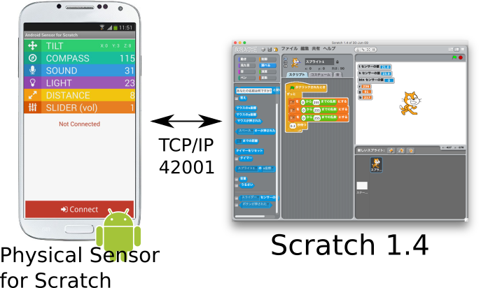
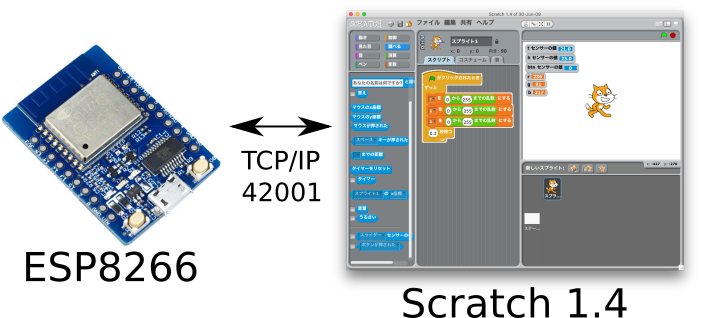
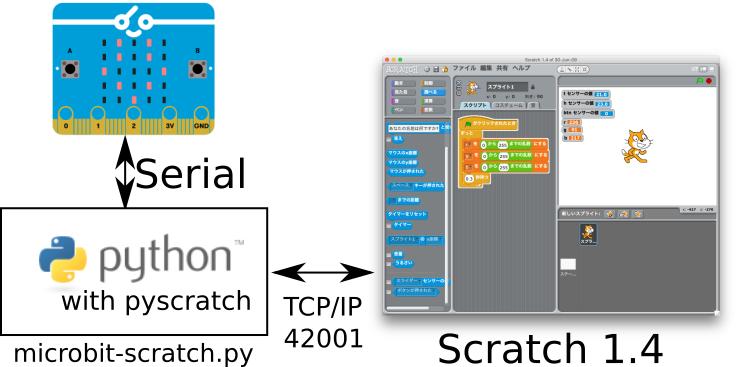

.. 
 Copyright (c) 2017 Takeshi MUTOH All rights reserved.
 Redistribution and use in source and binary forms, with or without
 modification, are permitted provided that the following conditions
 are met:
 1. Redistributions of source code must retain the above copyright
    notice, this list of conditions and the following disclaimer.
 2. Redistributions in binary form must reproduce the above copyright
    notice, this list of conditions and the following disclaimer in the
    documentation and/or other materials provided with the distribution.
 THIS SOFTWARE IS PROVIDED BY THE AUTHOR ``AS IS'' AND ANY EXPRESS OR
 IMPLIED WARRANTIES, INCLUDING, BUT NOT LIMITED TO, THE IMPLIED WARRANTIES
 OF MERCHANTABILITY AND FITNESS FOR A PARTICULAR PURPOSE ARE DISCLAIMED.
 IN NO EVENT SHALL THE AUTHOR BE LIABLE FOR ANY DIRECT, INDIRECT,
 INCIDENTAL, SPECIAL, EXEMPLARY, OR CONSEQUENTIAL DAMAGES (INCLUDING, BUT
 NOT LIMITED TO, PROCUREMENT OF SUBSTITUTE GOODS OR SERVICES; LOSS OF USE,
 DATA, OR PROFITS; OR BUSINESS INTERRUPTION) HOWEVER CAUSED AND ON ANY
 THEORY OF LIABILITY, WHETHER IN CONTRACT, STRICT LIABILITY, OR TORT
 (INCLUDING NEGLIGENCE OR OTHERWISE) ARISING IN ANY WAY OUT OF THE USE OF
 THIS SOFTWARE, EVEN IF ADVISED OF THE POSSIBILITY OF SUCH DAMAGE.

=================================
BSDで楽しむ!! Scratch / Squeak
=================================

============
はじめに
============
* http://qml.610t.org/FreeBSD/ScratchBSD.html

.. toctree::
   :maxdepth: 2

============
Squeak Etoys
============

Squeak VM環境構築
-------------------
| % pkg install squeak

Etoysのインストール
-------------------

Squeak+Gainerで遊ぶ
-------------------
* N:KMでブース出したよ http://qml.610t.org/squeak/mutoh_20090321.html

============
Scratch 2.0
============

Scratch 2.0環境構築
---------------------

flash対応ブラウザをインストールする
^^^^^^^^^^^^^^^^^^^^^^^^^^^^^^^^^^^^

flashpluginの設定
^^^^^^^^^^^^^^^^^^^^^^^^^^^^^^^^

============
Scratch 1.4
============
Scratch 1.4環境の構築
------------------------
| % pkg install scratch

USB Camera
------------------------
FreeBSDで利用できるカメラを用意します。

一番確実なのは、WindowsやmacOS用に売られているものの中で、
ドライバ不要となっているものを使うことです。
このようなカメラはUSB Video Class (uvideo) としてUSB仕様の中で定義されており、
FreeBSDもuvideoドライバで対応しています。

Scratch Sensor Board
------------------------
* 日本で買えるScratchセンサーボード http://swikis.ddo.jp/WorldStethoscope/54

* なのぼ～ど http://tiisai.dip.jp/?page_id=935
* nekoboard2 https://www.switch-science.com/catalog/2700/

Scratch Remote Sensor
------------------------
Scratch Remote Sensor (遠隔センサー)とは、 
Scratch が外の世界とやり取りするために用いられるシンプルですが強力な機能です。

公式情報は、"Remote Sensor Protocol  https://wiki.scratch.mit.edu/wiki/Remote_Sensors_Protocol" にあります。

Android
^^^^^^^^^^^^^^^^^^^^^

ESP8266
^^^^^^^^^^^^^^^^^^^^^

.. literalinclude:: src/ScratchSensorBoard_ESP8266.ino
   :language: c

micro:bit (chibi:bit)
^^^^^^^^^^^^^^^^^^^^^

参考文献
^^^^^^^^^^
* Scratch遠隔センサーとESP8266 http://qml.610t.org/squeak/CodarDojoNara201612.html
* Scratchと物理世界をつなごう!! http://qml.610t.org/squeak/ScratchDay2016.html

* BBC micro:bit(chibi:bit)+scratch でのプログラミングテスト http://qiita.com/asondemita/items/8ad1a9d224ee54428bed

micro:bitのmuソースコードは、以下の通りです。

.. code-block:: python

  from microbit import *

  def get_sensor_data():
    x, y, z = accelerometer.get_x(), accelerometer.get_y(), accelerometer.get_z()
    a, b = button_a.is_pressed(), button_b.is_pressed()
    print(x, y, z, a, b)
  
  uart.init(115200)
  
  while True:
    sleep(100)
    get_sensor_data()
    if uart.any():
        str=uart.readline()
        display.scroll(str,wait=False,loop=True)

microbit-scratch.pyのソースコードは、以下の通りです。

.. code-block:: python

  import serial
  from time import sleep
  import scratch

 class ScratchReceiver(object):
  @staticmethod
  def broadcast_handler(message):
    print('[receive] broadcast:', message)
    s.write(message.encode('utf-8'))
  @staticmethod
  def sensor_update_handler(**sensor_data):
    for name, value in sensor_data.items():
      print('[receive] sensor-update:', name, value)

  PORT = "/dev/cuaU0"
  BAUD = 115200

  s = serial.Serial(PORT)
  s.baudrate = BAUD
  s.parity   = serial.PARITY_NONE
  s.databits = serial.EIGHTBITS
  s.stopbits = serial.STOPBITS_ONE

  rsc = scratch.RemoteSensorConnection(ScratchReceiver.broadcast_handler, ScratchReceiver.sensor_update_handler)  
  rsc.connect()  
  while True:
    data = s.readline().decode('UTF-8')
    data_list = data.rstrip().split(' ')
    try:
        x, y, z, a, b = data_list
        print(x,y,z,a,b)
        rsc.send_sensor_update(x=int(x))
        rsc.send_sensor_update(y=int(y))
        rsc.send_sensor_update(z=int(z))
        rsc.send_sensor_update(a=str(a))
        rsc.send_sensor_update(b=str(b))
    except:
        pass
  rsc.disconnect()  

============
Scratch 3.0
============
Scratch 3.0環境の構築
---------------------

Node.jsのインストール
^^^^^^^^^^^^^^^^^^^^^^
::

  [mutoh@pcbsd-t400] ~% cd /usr/ports/www/node
  [mutoh@pcbsd-t400] /usr/ports/www/node% sudo make install

Scratch 3.0 github版のインストール
^^^^^^^^^^^^^^^^^^^^^^^^^^^^^^^^^^
はじめに、Scratch 3.0のソースを、githubから以下のようにして取得します。
::

  [mutoh@pcbsd-t400] ~/Scratch% git clone https://github.com/LLK/scratch-vm.git
  Cloning into 'scratch-vm'...
  remote: Counting objects: 4288, done.
  remote: Compressing objects: 100% (50/50), done.
  remote: Total 4288 (delta 26), reused 0 (delta 0), pack-reused 4238
  Receiving objects: 100% (4288/4288), 10.55 MiB | 755.00 KiB/s, done.
  Resolving deltas: 100% (2758/2758), done.
  Checking connectivity... done.

::

  [mutoh@pcbsd-t400] ~/Scratch% cd scratch-vm

参考文献
--------
* scratch-vm (Scratch 3.0 ?) を動かしてみました https://ict.laboradian.com/try-scratch-vm/

=====
CogVM
=====

